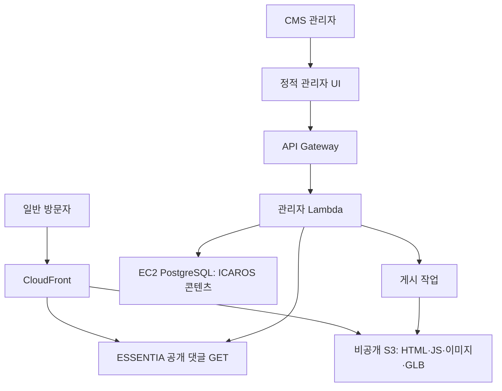

# ICAROS 웹 리뉴얼 아키텍처 설계

작성일: 2026-09-30
상태: 최종 권장 설계안(구현 전 검증 필요)
범위: ICAROS 공개 웹, 관리자 콘텐츠 발행, ESSENTIA 커뮤니티 연동, 미디어 전송

## 1. 결정 요약

공개 웹은 Next.js 정적 내보내기(SSG)로 만든 HTML·JS·CSS를 비공개 S3에 보관하고 CloudFront로 전달한다. 로켓 제원과 게시글처럼 검색에 노출할 핵심 내용은 첫 HTML에 포함하고, CMS에서 **게시**할 때 HTML·메타데이터·사이트맵을 다시 만든다. 작은 공개 JSON은 필요할 때 목록 탐색에만 사용하며 SEO 본문의 유일한 원본으로 삼지 않는다. 고용량 이미지와 GLB도 S3에서 CloudFront를 통해 직접 전달한다. 관리자 UI는 정적 파일로 제공하되 인증·콘텐츠 수정·업로드·게시 요청은 API Gateway HTTP API와 Lambda가 처리한다. 공개 방문자의 페이지 요청은 ICAROS 데이터베이스에 연결하지 않는다.

ESSENTIA는 ICAROS 커뮤니티 게시글·댓글·인증 상태 데이터의 원본이다. ICAROS 커뮤니티 게시글은 **CMS 관리자만 작성**할 수 있으며, CMS가 ESSENTIA의 권한 제한된 쓰기 API를 호출한다. 일반 방문자는 ICAROS 웹에서 **보기만 가능**하며 로그인·글쓰기·댓글 작성·수정 요청을 보내지 않는다. ESSENTIA의 공개 가능한 댓글과 인증 상태는 읽기 전용으로 반영한다. ICAROS의 고유 페이지·로켓·멤버·미디어 메타데이터는 ICAROS 콘텐츠 저장소에서 관리한다.

현재 자체 관리자 기능을 분리해 재사용하는 것을 기본안으로 삼는다. Payload CMS는 편집 기능에 실제 부족분이 확인되면 별도 검토한다. 항상 켜진 새 웹서버와 공개 요청용 PostgreSQL 연결은 도입하지 않는다. 저장 직후 CMS 미리보기는 최신 내용을 표시하지만, 방문자에게는 게시 작업이 성공한 뒤 새 HTML이 보인다. 검색 결과의 실제 갱신 시점은 검색엔진의 재크롤링에 달려 있다.

### 대안 비교와 선택

| 방식 | 편집 후 공개 | SEO 첫 HTML | 운영 부담 | 판단 |
| --- | --- | --- | --- | --- |
| SSG + 게시 트리거 빌드 | 빌드·배포 완료 후 | 완전한 본문 | 빌드 파이프라인 | **채택**: 읽기 전용, 수정 빈도가 낮은 ICAROS에 적합 |
| 공개 JSON만 클라이언트에서 읽기 | 캐시 갱신 후 | 본문 누락 가능 | 낮음 | 핵심 제원·글 본문에는 사용하지 않음 |
| SSR/ISR 실행 환경 + CDN | 서버 캐시 재생성 후 | 완전한 본문 | 런타임·캐시·DB 보호 | 게시 지연이 허용치 밖일 때 재평가 |

### 실무 적용 근거와 한계

- **AWS 공식 구성**은 S3·CloudFront의 정적 화면과 API Gateway의 동적 API를 같은 배포 도메인에서 경로별로 제공하는 패턴을 제시한다. 이는 ICAROS의 공개 화면과 관리자 API를 분리하는 근거다. [AWS CloudFront 다중 원본 가이드](https://docs.aws.amazon.com/solutions/improved-single-page-application-performance-using-amazon-cloudfront/)
- **실제 운영 사례:** University of St. Thomas는 여러 CMS의 발행물을 S3에 모으고 CloudFront에서 캐시했다. 중간의 EC2 동기화 서버 등 세부 구현은 ICAROS와 다르지만, `CMS 발행 → 정적 S3 → CloudFront` 경로를 운영한 사례다. [AWS Architecture Blog](https://aws.amazon.com/blogs/architecture/architecting-a-low-cost-web-content-publishing-system/)
- **실제 운영 사례:** Wayfx의 헤드리스 WordPress 사이트는 CMS 변경 뒤 빌드 훅으로 정적 사이트를 재생성했다. 사례 글의 2~4분은 해당 서비스와 시점의 관측값이지 ICAROS의 예상 게시 시간이 아니다. [Netlify 사례](https://www.netlify.com/blog/2019/05/16/wayfx-deploys-lightning-fast-headless-wordpress-to-netlify/)
- **대안 사례:** Hydrow는 Contentful·Next.js·Vercel의 사전 렌더링과 ISR을 사용해 편집 반영을 개선했다. 게시 지연이 짧아야 하는 경우의 대안이지, S3 정적 내보내기에 ISR이 자동으로 생긴다는 뜻은 아니다. [Contentful 사례](https://www.contentful.com/blog/hydrow-instant-publishing-workflow-contentful-next-js/)
- 위 사례와 공식 가이드는 **검증된 아키텍처 패턴**을 보여주지만 시장 전체의 채택 비율을 제공하지 않는다. ICAROS의 `ESSENTIA 소유 API + CMS 전용 글쓰기 + 자체 PostgreSQL` 조합은 프로젝트별 설계이며, 동일한 구현이 흔하다고 주장하지 않는다.

## 2. 전제와 확인 범위

- 이 설계는 앞서 확인한 `ESSENTIA-Science/ICAROS-web`의 `main` 코드와 사용자에게 들은 운영 구성을 토대로 한다. `/Users/aiden/dev/ICAROS-web`의 현재 로컬 변경 사항과 실제 AWS 리소스 설정은 이 세션에서 확인하지 못했다. 구현 전 다시 검증한다.
- 기존 앱은 Next.js 16 App Router, React 19, Drizzle/`pg`, 자체 `/admin`, Server Actions, `/api/media/[id]`, 업로드 API, DB 기반 공개 페이지를 사용한다. 게시판의 일부 경로는 동적이고 차량 상세는 요청 시 생성에 기대고 있다.
- ESSENTIA는 EC2 `t4g.small`에서 자체 PostgreSQL을 운영하며 S3를 사용한다. 과거 공유 DB 연결 급증으로 ESSENTIA 서비스에도 장애가 났으므로 연결 상한은 설계 제약이다.
- ICAROS 공개 웹은 읽기 전용이다. ESSENTIA에서 댓글이 작성·수정되는 경우 ICAROS는 그 결과만 표시한다. '인증 상태'가 어떤 도메인 데이터와 표시 규칙을 가리키는지는 ESSENTIA API 계약에서 확인한다.
- 비용·처리량·사용자 수는 실측치가 없으므로 특정 월 비용이나 성능을 보장하지 않는다.

## 3. 목표와 경계

1. 대형 이미지와 3D 자산의 첫 화면 부담을 줄이고 반복 방문에 CDN 캐시를 활용한다.
2. 일반 방문자의 요청 수가 늘어도 ICAROS의 DB 연결 수가 방문자 수에 비례하지 않도록 한다.
3. ESSENTIA 커뮤니티 탭과 ICAROS 사이트가 같은 게시글·댓글·인증 상태를 읽도록 한다. ICAROS 공개 사이트에는 쓰기 UI/API를 제공하지 않는다.
4. 콘텐츠 저장과 사이트 공개를 구분하고 실패 시 기존 사이트를 유지한다.
5. 기존 유지보수 모드, URL, SEO, 접근 제어를 정적 호스팅에서 다시 구현한다.

이 설계는 운영 배포 또는 기존 DB 이전을 승인하는 문서가 아니다. 구현과 배포 전에 로컬 코드, API 계약, 운영 설정의 검증이 필요하다.

## 4. 구성 요소와 요청 경로

### 구현 스택

| 기능 | 선택 | 이유 |
| --- | --- | --- |
| 공개 웹 | 기존 React 19·Next.js 16 App Router의 정적 내보내기 | 기존 화면을 이관하면서 경로별 HTML을 빌드해 SEO 유지 |
| 3D 뷰어 | 기존 Three.js 구성 유지, GLB·포스터 분리 | 새 렌더러 도입 없이 다운로드·초기화 시점을 제어 |
| 관리자 화면 | 기존 관리자 UI를 정적 프론트엔드로 분리 | 편집 흐름 재사용; 서버 기능은 API로 이전 |
| 관리자 API | API Gateway HTTP API + Node.js Lambda | 관리자 요청 때만 실행, 별도 상시 웹서버 불필요 |
| 콘텐츠 데이터 | 기존 Drizzle/`pg`를 Lambda에서 사용 | ICAROS 고유 콘텐츠만 접근; ESSENTIA 커뮤니티는 API 소유 |
| 게시 빌드 | AWS CodeBuild | CMS 게시 이벤트에서 Next.js 빌드와 검증을 실행; GitHub 코드 배포와 분리 |
| 미디어 처리 | S3 원본·사전 생성 변형·CloudFront | 공개 읽기 요청에서 DB 조회와 이미지 변환 제거 |

Next.js 정적 내보내기는 Server Actions, 요청별 쿠키·헤더, 미리 생성하지 않은 동적 경로, ISR 등을 그대로 제공하지 않는다. 기존 코드를 `output: 'export'` 설정만 더해 배포할 수 없으며 관리자 API와 공개 DB 조회를 먼저 분리해야 한다.



| 경로 | 실행 위치 | 원본 | 캐시 원칙 |
| --- | --- | --- | --- |
| 홈·소개·로켓·멤버·게시글 공개 페이지 | 정적 빌드 → S3 → CloudFront | 게시 시점의 콘텐츠 스냅샷 | HTML은 짧게, 해시가 붙은 JS/CSS는 길게 |
| 선택적 공개 목록 JSON | CMS 게시 시 S3 갱신 → CloudFront | ICAROS 콘텐츠·ESSENTIA 게시글 | 화면 탐색에 필요할 때만; HTML과 동일 발행 버전 |
| 이미지 변형·포스터·GLB·텍스처 | S3 → CloudFront | 버전 또는 콘텐츠 해시가 붙은 객체 | 공개 자산은 장기 캐시; 변경 시 새 URL |
| CMS UI | 정적 빌드 → S3 → CloudFront | 관리자 프론트엔드 | 정적 파일 캐시; UI 공개 자체를 인증으로 여기지 않음 |
| CMS API | CloudFront 경유 또는 별도 API 도메인 → API Gateway → Lambda | ICAROS 콘텐츠 DB·ESSENTIA 쓰기 API | 인증 API 캐시 비활성화 |
| 공개 댓글·인증 상태 표시 | 읽기 전용 ESSENTIA API 또는 이벤트 기반 S3 투영 → CloudFront | ESSENTIA | 공개 GET만 짧게 캐시; 개인 데이터 제외 |

CloudFront 앞단 도메인을 통일한다면 `/api/admin/*`은 API Gateway, 공개 댓글을 API로 제공하는 경우 `/api/community/*`은 ESSENTIA의 읽기 전용 GET으로 구분한다. 공개 사이트에서 ESSENTIA 쓰기 메서드나 방문자 인증 쿠키를 전달하지 않는다. CMS API에는 별도의 관리자 인증, 허용 메서드, CORS, CSRF 보호를 적용한다.

S3는 웹사이트 엔드포인트가 아닌 일반 버킷 원본을 쓰고 CloudFront OAC로 비공개 접근을 제한한다. `/posts/123/` 같은 하위 URL은 내보낸 파일 형식에 맞는 CloudFront Function 재작성 규칙을 둔다. 존재하지 않는 글을 `/index.html`과 HTTP 200으로 일괄 대체하지 않는다.

## 5. 데이터 소유권과 API 계약

| 데이터 | 소유자 | 쓰기 경로 | 공개 웹 읽기 경로 |
| --- | --- | --- | --- |
| ICAROS 소개·로켓·멤버·페이지 구성 | ICAROS | CMS API → ICAROS 스키마 | 정적 페이지 + 게시 시 갱신된 공개 JSON |
| ICAROS 커뮤니티 게시글·댓글·인증 상태 | ESSENTIA | 게시글: CMS 전용 ESSENTIA API; 댓글·상태: ESSENTIA 내부 흐름 | 공개 글 JSON·상세 HTML; 댓글·상태의 읽기 전용 조회 또는 투영 |
| 이미지·3D 원본과 변형 | ICAROS 미디어 저장소 | 관리자 업로드 API → S3 | CloudFront 자산 URL |
| 게시 상태·실행 이력 | ICAROS | 게시 작업 | CMS 상태 화면 |

CMS가 ESSENTIA의 커뮤니티 테이블에 직접 SQL을 쓰거나 양쪽 DB에 게시글 본문을 독립적으로 쓰지 않는다. ESSENTIA는 CMS 전용 서비스 자격으로 글 작성·수정·삭제 API를 제공하고, 요청마다 멱등성 키를 받는다. 응답에는 안정적인 게시글 ID, 버전, 공개 상태, 수정 시각을 포함한다. 목록/상세 읽기 API에는 게시 빌드에 필요한 본문·저자 표시 정보·대표 이미지를 제공한다.

관리자 권한은 CMS API에서 검사한다. CMS 화면에서 버튼을 숨기는 것만으로 글 쓰기 권한을 보장하지 않으며, ESSENTIA도 호출 주체와 ICAROS 범위를 검사해야 한다. 공개 웹에는 댓글 작성이나 사용자 로그인 엔드포인트를 노출하지 않는다. 기존 레거시 글의 ID와 URL 매핑, 수정·삭제 권한, 양쪽 화면의 표시 규칙은 마이그레이션 표로 기록한다.

## 6. 하이브리드 게시 파이프라인

1. CMS에서 초안을 저장하고 미리본다. **게시**를 누르면 게시글은 ESSENTIA API가 원본을 확정하고 ID·버전을 반환한다.
2. CMS는 게시 작업을 기록한다. 빠르게 연속 변경되어도 최신 버전만 공개하도록 작업을 직렬화하거나 이전 작업을 무효화한다.
3. 보호된 내보내기 작업은 공개 가능한 콘텐츠 스냅샷을 버전과 함께 S3에 기록한다. 목록 탐색용 공개 JSON이 필요하면 같은 버전에서 함께 생성하고, HTML에는 해당 버전의 JSON URL을 기록한다. 공개 JSON에는 비공개 필드를 포함하지 않는다. 검색 대상인 제원·글 본문·제목을 JSON만 바꾼 상태를 `공개됨`으로 간주하지 않는다.
4. 신규 글뿐 아니라 기존 로켓 제원·게시글 본문·제목·메타데이터가 바뀌어도 CodeBuild가 검색엔진용 HTML을 갱신한다. 배포 승인된 웹 소스 커밋과 게시 스냅샷 버전을 입력으로 고정한다. 새 slug는 경로를 만들고, 삭제된 콘텐츠는 실제 404 및 사이트맵 제거를 적용한다. Next.js 정적 내보내기에서 부분 빌드가 가능한지 먼저 검증하고, 불가능하면 전체 빌드한다. Lambda에서 전체 Next.js 빌드를 직접 실행하지 않는다. 빌드 러너가 EC2의 사설 PostgreSQL에 직접 연결하지 않도록 버전이 있는 스냅샷을 제공한다.
5. 링크·대표 페이지·404·미디어 경로를 검증하고 버전이 붙은 자산을 먼저 업로드한다. HTML을 마지막에 공개하고 영향을 받은 캐시만 무효화한다.
6. 검증에 실패하면 기존 ICAROS 공개 버전을 유지한다. 새 HTML은 이미 업로드한 동일 버전의 JSON·자산을 참조한다. CloudFront 캐시 갱신 중에는 방문자마다 잠시 서로 다른 HTML 버전을 볼 수 있으므로 사이트 전체가 한순간에 원자적으로 바뀐다고 보장하지 않는다. CMS에는 `초안 저장됨`, `게시 중`, `공개됨`, `실패`를 구분해 보여준다. ESSENTIA에 이미 반영됐지만 ICAROS 게시 빌드가 실패하면 두 사이트의 일시적 불일치를 감지·재시도·알림 처리한다. 수정·삭제 시 옛 JSON·HTML 객체와 검색 색인 노출 여부까지 처리한다.

스냅샷에는 발행 버전, 생성 시각, 각 레코드의 원본 ID와 버전을 기록한다. 같은 작업의 재시도는 중복 게시글이나 중복 자산을 만들지 않아야 한다. JSON과 HTML의 참조 버전이 달라지지 않도록 게시 순서와 롤백을 검증한다. 비공개 전환처럼 긴급성이 높은 작업은 전체 빌드 완료 전에도 해당 경로를 차단하거나 제거할 수 있는 운영 절차를 둔다. 공개 댓글 갱신이 즉시 중요하면 ESSENTIA의 읽기 전용 GET을 짧게 캐시하고, DB 부하가 우선이면 변경 이벤트로 S3 투영을 갱신한다.

## 7. 기존 Next.js 기능의 전환

| 현재 의존성 | 목표 처리 |
| --- | --- |
| 홈·레이아웃·멤버·게시글의 런타임 DB 조회 | 검색 대상 내용이 포함된 정적 HTML; 목록 탐색에만 선택적 공개 JSON |
| 동적 게시글·차량 상세와 요청 시 생성/ISR | 공개 대상 ID·slug를 빌드 시 모두 열거; 새 콘텐츠는 재게시 |
| 검색 파라미터 기반 게시판 페이지 | 색인할 목록은 실제 HTML 페이지로 생성; 필터·탐색 UI에만 선택적 JSON; 상세 HTML은 별도 생성 |
| Server Actions, 쿠키 기반 관리자 작업, 업로드·확인·재검증 API | 정적 관리자 UI + 인증된 Lambda API + 게시 작업 |
| `/api/media/{id}`의 DB 조회·S3 중계 | 공개 이미지 변형의 CloudFront 직URL; 비공개 미디어는 별도 정책 |
| `next/image` 기본 최적화 서버 | 미리 생성한 이미지 변형과 정적 내보내기에 맞는 이미지 로더 |
| 미들웨어 유지보수·리다이렉트 | CloudFront Function/배포 설정의 유지보수 응답과 URL 재작성 |

`MAINTENANCE_MODE=on`은 현재 미들웨어가 읽는 서버 환경변수다. 정적 배포에서는 값만 바꿔도 CloudFront가 알아서 503을 반환하지 않는다. 유지보수 켜기·끄기를 명시적 운영 절차로 구현하고, 관리자 API와 상태 확인 경로의 예외 여부를 결정한다.

## 8. 이미지와 3D 전송

- 업로드 원본은 보존하고 공개용 반응형 이미지 크기와 WebP/AVIF를 사전 생성한다. 이미지 변환 작업이 재시도되어도 같은 출력이 나오도록 한다.
- 첫 화면 LCP 후보 이미지는 적합한 크기로 즉시 요청하고, 화면 밖 이미지는 `loading="lazy"`를 사용한다. `srcset`/`sizes`를 실제 표시 크기에 맞춰 과대 다운로드를 피한다.
- GLB와 텍스처는 공개 S3 자산 URL로 전달한다. 첫 화면에는 가벼운 포스터를 먼저 표시하고, 뷰어가 화면에 들어오거나 사용자가 실행할 때 3D 코드와 모델을 요청한다.
- GLB 자체의 메시·텍스처 크기, 압축, 파싱 시간, GPU 업로드를 실측한다. CloudFront 캐시 적중만으로 모델 준비 시간이 해결되지는 않는다. 모바일 저사양·WebGL 불가 환경에는 포스터와 텍스트 대체 경로를 둔다.
- HTML은 짧은 캐시 또는 재검증, 버전이 붙은 이미지·GLB·JS는 긴 `immutable` 캐시를 적용한다. 공개 URL에 개인정보나 인증이 필요한 사진을 넣지 않는다.
- 비교 지표는 실제 전송 바이트, LCP, 포스터 표시 시간, 모델 표시 완료 시간, CDN 적중률, 모바일 실패율로 둔다. 목표치는 기준선 측정 후 확정한다.

## 9. 데이터베이스·네트워크·보안

관리자 Lambda의 PostgreSQL 연결은 동시 실행 수 × 인스턴스당 풀 크기로 계산한다. DB 접근 Lambda의 예약 동시 실행을 제한하고 각 실행 환경의 풀을 작게 유지한다. EC2 PostgreSQL의 ESSENTIA 여유 연결 수를 먼저 측정해 ICAROS 연결 예산을 배정한다. 필요성이 확인되면 PgBouncer를 검토하되, 이를 연결 무한 확장의 근거로 삼지 않는다. RDS Proxy는 현재 자체 호스팅 PostgreSQL을 위한 기본 해법으로 가정하지 않는다.

사설 EC2 DB에 닿는 VPC Lambda가 공개 ESSENTIA API도 호출해야 한다면 인터넷 출구 구성이 필요하다. ESSENTIA API의 VPC 내부 접근이 가능하면 그 경로를 우선 검토한다. 불가능하면 DB 접근과 외부 API 작업을 분리해 NAT 관련 고정 비용을 포함해 비교한다. S3 접근, 빌드 러너의 스냅샷 접근, 비밀값 보관과 회전 방법도 실제 VPC 설정에 맞춰 검증한다.

관리자 API는 CloudFront에서 공유 캐시를 끈다. 공개 읽기 전용 JSON/GET과 CMS 인증 API의 경로·캐시 정책을 분리한다. CMS 인증 쿠키와 Authorization 전달 여부, CORS, CSRF, 관리자 권한 검사, S3 최소 권한, 업로드 파일 형식·크기 제한을 점검한다. 정적 `/admin` 파일은 다운로드될 수 있으므로 API가 모든 권한을 강제한다. CloudFront·API Gateway·Lambda 로그에는 비밀값과 게시글 내 비공개 데이터가 남지 않게 한다.

## 10. 저장소 디렉터리와 GitHub CI/CD

**한 GitHub 저장소, 세 배포 단위**를 사용한다. `FE`는 공개 정적 웹, `CMS`는 관리자 정적 UI, `API`는 Lambda 백엔드다. ESSENTIA 서비스 자체는 이 저장소의 네 번째 앱으로 옮기지 않고 별도 소유 서비스/API로 연동한다.

```text
ICAROS-web/
├─ apps/
│  ├─ web/                         # FE: Next.js 정적 내보내기
│  │  ├─ src/app/                   # Home, Rockets, Posts, Members와 메타데이터
│  │  ├─ src/components/three/      # 로켓 3D 뷰어·포스터
│  │  ├─ src/lib/content/           # 빌드 스냅샷 읽기·경로 열거
│  │  └─ next.config.ts
│  └─ cms/                         # CMS: React + Vite 정적 관리자 UI
│     └─ src/
│        ├─ pages/                  # 로켓·페이지·글 편집과 미리보기
│        ├─ components/
│        └─ lib/api/                # API 클라이언트·관리자 상태
├─ services/
│  └─ api/                         # API Gateway → Lambda
│     └─ src/
│        ├─ auth/                   # 관리자 인증·권한
│        ├─ content/                # ICAROS 고유 콘텐츠·DB
│        ├─ community/              # ESSENTIA CMS 전용 API
│        ├─ media/                  # 업로드 허가·메타데이터
│        └─ publish/                # 스냅샷·CodeBuild 요청·게시 상태
├─ packages/
│  └─ contracts/                   # CMS ↔ API 타입·요청 검증
├─ infra/                           # S3·CloudFront·API Gateway·Lambda·IAM
├─ scripts/                         # 정적 빌드·배포·URL/자산 검사
├─ legacy/                          # 기존 웹 보존, 새 빌드·배포에서 제외
├─ .github/workflows/
│  ├─ web.yml                       # FE 코드 변경 배포
│  ├─ cms.yml                       # CMS UI 코드 변경 배포
│  ├─ api.yml                       # API 코드 변경 배포
│  └─ infra.yml                     # 인프라 변경 검토·적용
└─ package.json                     # 루트 워크스페이스 명령
```

패키지 관리자는 기존 저장소의 lockfile을 확인한 뒤 유지한다. npm workspaces 또는 pnpm workspace 중 하나만 사용하고 `apps/*`, `services/*`, `packages/*`만 포함한다. `legacy/`와 빌드 산출물은 새 워크스페이스·TypeScript 검사·배포 입력에서 제외한다. `packages/ui`는 두 화면이 실제로 공유할 컴포넌트가 생겼을 때만 추가한다.

| 변경 경로 | 코드 CI/CD | 배포 산출물 |
| --- | --- | --- |
| `apps/web/**` 또는 웹 빌드 의존 패키지 | `web.yml`: 검사 → 정적 빌드 → 링크·SEO 검증 → 배포 | 공개 HTML·JS·CSS |
| `apps/cms/**` 또는 CMS 의존 패키지 | `cms.yml`: 검사 → Vite 빌드 → 배포 | `/admin/*` 정적 UI |
| `services/api/**` 또는 API 의존 패키지 | `api.yml`: 검사 → Lambda 번들 → 배포·스모크 테스트 | `/api/admin/*` |
| `infra/**` | `infra.yml`: 변경 검토 → 승인된 환경에 적용 | AWS 리소스 설정 |
| `legacy/**` | 새 앱 배포 없음 | 없음 |

공용 계약(`packages/contracts`)이 바뀌면 이를 사용하는 CMS·API를 함께 검사하며 웹에서 사용하면 웹도 검사한다. 인프라나 루트 빌드 설정 변경도 영향 분석 대상이다. GitHub Actions의 경로 필터만으로 의존성을 자동 추론하지 않는다. 세 정적/API 배포는 독립 실행하되 하나의 릴리스에 호환성이 필요한 변경은 API와 CMS의 순서·호환 기간을 계획한다. [GitHub Actions 경로 필터](https://docs.github.com/en/actions/reference/workflows-and-actions/workflow-syntax)

**코드 배포와 콘텐츠 발행은 다른 파이프라인이다.** `main` 머지는 GitHub Actions가 변경된 앱을 배포한다. CMS의 `게시` 버튼은 Git 커밋을 만들지 않고 `services/api`가 게시 스냅샷과 CodeBuild 작업을 시작한다. CodeBuild는 현재 배포 승인된 FE 커밋을 사용해 콘텐츠만 다시 빌드한다. 코드 배포와 콘텐츠 게시가 겹치면 마지막 작업이 오래된 HTML을 덮지 않도록 배포 작업을 직렬화하고 버전을 비교한다. 빌드 실패는 CMS에 표시하고 이전 공개 버전을 보존한다.

CloudFront 경로는 기본 동작 → FE, `/admin/*` → CMS, `/api/admin/*` → API로 분리한다. `/admin`처럼 슬래시가 없는 요청은 `/admin/`으로 리다이렉트한다. FE와 CMS가 같은 S3 버킷의 서로 다른 접두사를 쓰더라도 한 앱의 `sync --delete`가 다른 앱 파일을 지우지 않도록 배포 범위를 제한한다. GitHub Actions의 AWS 권한은 OIDC로 단기 자격을 받아 앱별 최소 권한 IAM 역할을 사용하고 장기 AWS 키를 저장하지 않는다. [GitHub AWS OIDC 가이드](https://docs.github.com/en/actions/how-tos/secure-your-work/security-harden-deployments/oidc-in-aws)

## 11. `legacy/` 보존과 단계별 이행

기존 프로젝트를 `legacy/`로 보존할 때 먼저 Git 상태와 미커밋 변경을 확인한다. `.git`, 개발 비밀값, `node_modules`, 빌드 산출물을 무작정 이동하지 않는다. 기존 자산·라우트·DB 마이그레이션·리다이렉트 표를 만들고 재현 가능한 기준 커밋을 기록한다. 새 웹은 확인된 경로와 자산을 선택적으로 이관한다. `legacy/`는 구동 방법을 문서화하되 새 빌드의 입력에는 포함하지 않는다.

| 단계 | 작업 | 완료 기준 |
| --- | --- | --- |
| 0. 현황 고정 | 로컬 코드·Git·AWS·ESSENTIA API·DB 연결 예산 확인, 기존 URL/미디어 목록 작성 | 전환 대상과 되돌릴 기준 버전 확인 |
| 1. 미디어 | S3+CloudFront OAC, 이미지 변형, GLB 포스터·지연 로딩, 기존 `/api/media` 참조 교체 | 핵심 화면의 요청 수·전송량·모델 준비 시간 측정 |
| 2. 데이터 계약 | ESSENTIA CMS 전용 쓰기 API, 공개 댓글·인증 상태의 읽기 전용 경로, ID 매핑 | 양쪽 화면에서 같은 게시글과 댓글 확인; 공개 쓰기 요청 차단 |
| 3. 관리자 | 관리자 UI/API 분리, 작은 DB 풀과 동시 실행 상한, 업로드·게시 상태 | 권한 우회 및 실패·재시도 검증 |
| 4. 정적 게시 | 검색 대상 HTML·메타데이터·사이트맵 생성, 필요할 때만 작은 공개 JSON, 링크·404·삭제 검증 | 제원·게시글 변경 후 SEO HTML이 새 버전으로 공개; 일반 방문자에게 쓰기 기능 없음 |
| 5. 전환 | CloudFront 라우팅·유지보수·캐시·관측·롤백 절차 | 이전/신규 사이트 비교 후 점진적 전환; 운영 배포는 별도 결정 |

초기에는 기존 런타임을 유지하면서 미디어 CDN만 먼저 전환할 수 있다. 정적화가 완료되기 전 공개 경로에 DB 의존성이 남아 있으면 이를 정적 사이트라고 선언하지 않는다.

## 12. 검증과 미결정 사항

검증 시나리오: 로켓 제원 수정 후 HTML·메타데이터 반영, 신규 글 게시·수정·삭제, ESSENTIA 측 댓글·인증 상태 읽기 반영, 공개 웹의 쓰기 요청 차단, CMS 관리자 권한, 잘못된 slug의 404, 게시 빌드 실패 및 롤백, ESSENTIA만 반영된 불일치 재시도, 업로드 중단과 중복 이벤트, 캐시 만료 전 수정, 유지보수 503, 모바일/WebGL 불가 환경, ESSENTIA API 및 EC2 DB 장애. 연결 수와 `CMS 게시 → 공개 HTML 확인` 시간을 실제로 관측한다.

구현 착수 전에 확인할 사항은 (1) ESSENTIA 커뮤니티 API의 공개 읽기 계약과 `인증 상태`의 정확한 뜻, (2) ICAROS 고유 콘텐츠의 필수 DB 범위, (3) 게시글 수·게시 빈도·허용 공개 지연, (4) 사설 DB와 Lambda의 네트워크 경로, (5) 사진 중 비공개 자산의 범위, (6) 기존 로컬 미커밋 변경과 운영 인프라 설정이다. 확인 결과에 따라 상세 HTML 생성 범위와 게시 러너 선택은 조정할 수 있다.

## 13. 참고 문서

- [Next.js Static Exports](https://nextjs.org/docs/app/guides/static-exports): 정적 내보내기에서 지원하지 않는 런타임 기능.
- [CloudFront default root object](https://docs.aws.amazon.com/AmazonCloudFront/latest/DeveloperGuide/DefaultRootObject.html): 하위 경로는 기본 루트 객체만으로 처리되지 않음.
- [CloudFront OAC for S3](https://docs.aws.amazon.com/AmazonCloudFront/latest/DeveloperGuide/private-content-restricting-access-to-s3.html): 비공개 일반 S3 버킷 원본과 OAC.
- [VPC Lambda internet access](https://docs.aws.amazon.com/lambda/latest/dg/configuration-vpc-internet.html): 사설 VPC Lambda의 외부 API 호출 경로.
- [Google JavaScript SEO basics](https://developers.google.com/search/docs/crawling-indexing/javascript/javascript-seo-basics): 검색 대상 내용의 서버 또는 사전 렌더링.
