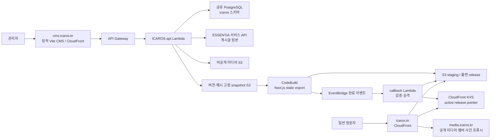

# ICAROS CMS 게시 아키텍처·장애 진단·개편 설계 — 2026-10-04

## 현재 결론과 범위

CMS의 개별 저장은 즉시 API와 DB에 반영된다. 관리자가 **전체 사이트 반영**을 누를 때만 공개 Next.js 정적 사이트를 새 스냅샷으로 다시 만든다. 최근 지연의 주원인은 Next.js 컴파일이 아니라 빌드 결과 366~371개를 S3에 순차 업로드하는 방식이다. 게시 완료 callback도 같은 파일을 여러 번 순차 조회하고, 그 네트워크 작업 동안 DB 잠금을 잡았다.

이 문서는 CMS에서 공개 웹까지의 실제 구성, 레거시 데이터의 처리, 측정값, 유사 아키텍처의 공식 자료, 추천 변경, 배포 전 검증 기준을 한곳에 정리한다. **속도 개편은 아직 구현·배포되지 않았다.** 아래의 개편 후 값은 목표이며 실측 결과가 아니다. 게시 상태 조회 잠금 제거와 정확한 실패 안내, 게시 완료 구조화 로그는 별도 핫픽스로 운영 반영됐다. 2026-09-30 작성된 저장소 루트의 초기 설계서는 당시 계획이므로, 현재 구현·운영 상태는 이 문서의 설명을 우선한다.

## 현재 운영 아키텍처와 데이터 소유권

- `apps/cms`는 정적 관리자 UI다. Cognito 로그인 후 같은 도메인의 `/api/admin/*`가 API Gateway·Lambda에 전달된다. 인증·권한은 API가 검사한다. Lambda의 외부 ESSENTIA/Cognito 접근에는 ESSENTIA API EC2의 전용 proxy 경로를 쓴다.
- `ICAROS-api`는 형제 저장소다. 사이트 설정·섹션·패널·기체·미션·멤버·부서·미디어 메타데이터는 공유 PostgreSQL의 **`icaros` 스키마**가 원본이다. ESSENTIA의 `public` 스키마는 이 게시 파이프라인이 수정하지 않는다. 게시글의 원본은 ESSENTIA 서비스 API다.
- `apps/web`은 Next.js 16 static export다. 일반 방문자의 HTML 요청은 DB나 ESSENTIA API를 호출하지 않는다. 공개 웹, CMS, 미디어는 별도 CloudFront 배포이며 Cloudflare는 해당 도메인의 DNS를 연결한다.
- 비공개 원본 미디어는 게시 시 검증된 공개 사본 또는 현재 게시 버전의 허용 목록을 사용하는 멤버 사진 프록시로 제공한다. 오래된 release와 사진의 보존·철회는 별도 운영 문제이며 단순한 pointer 롤백만으로 처리하지 않는다.
- 콘텐츠 게시는 CMS UI 코드 배포나 Git `main` 푸시가 아니다. 승인된 웹 소스 commit과 이번 콘텐츠 snapshot을 결합해 새로운 **전체 정적 사이트**를 만든다. `legacy/`의 예전 Next.js 앱 소스와 기존 Vercel 배포는 이 빌드의 입력이 아니다.

### CMS 변경 시 기존·레거시 데이터의 운명

| 대상 | 저장 후, 전체 게시 전 | 전체 게시 성공 후 |
| --- | --- | --- |
| 사이트 설정·기체·멤버·미션 등 기존 ICAROS 행 | 수정된 값은 `icaros` DB에 보존된다. 방문자는 이전 정적 release를 본다. | 현재 `published` 조건을 만족하는 **모든 행**을 다시 읽어 새 HTML에 포함한다. 이번에 수정하지 않은 행도 유지된다. |
| ESSENTIA 게시글 | 초안·수정본은 ESSENTIA가 소유한다. 전체 게시 요청은 먼저 해당 공개 버전을 ESSENTIA에 반영한다. | ESSENTIA의 공개 snapshot을 다시 읽어 새 정적 글 목록·상세에 포함한다. ESSENTIA 반영 뒤 정적 빌드가 실패하면 양쪽 공개 시점이 잠시 다를 수 있다. |
| 과거 `icaros.legacy_posts` | 2026-10-03 이관한 19개 원본 행은 삭제하지 않고 보관했다. 이관된 18개 공개 원본은 중복 방지를 위해 비공개로 전환했다. | 공개 조건이 켜진 레거시 행만 ESSENTIA 글과 합쳐 빌드한다. 현재 이관 글은 ESSENTIA 쪽 사본으로 노출되며 비공개 원본 행은 중복 노출되지 않는다. |
| 이전 정적 release와 해시 자산 | S3의 이전 버전 경로에 남고 현재 KVS pointer가 가리키는 release만 기본 공개 경로에 쓰인다. | 새 release가 완성·검증된 뒤 pointer가 바뀐다. 이전 release는 롤백 근거로 보존하지만 삭제·비공개 처리한 콘텐츠, 특히 멤버 사진을 되살리지 않도록 철회 검사가 필요하다. |
| `legacy/` 소스와 기존 Vercel 앱 | 보존된다. CMS 콘텐츠 저장과 무관하다. | 새 CloudFront 사이트가 이 앱으로 되돌아가거나 해당 소스를 자동 빌드하지 않는다. |

즉, 개편 후에도 **변경분만 패치하는 빌드가 아니라 전체 snapshot을 재생성**한다. 파일 운송·승격의 병렬화가 데이터 합치기 규칙을 바꾸지 않는다. DB 행을 명시적으로 삭제하거나 공개 상태를 내리면 그 콘텐츠는 다음 snapshot에서 빠진다. 새 release 생성·검증이 실패하면 현재 KVS pointer를 유지하므로 방문자는 직전 정적 사이트를 계속 본다. 단, 전체 게시 전에 ESSENTIA로 승격한 글의 공개 시점은 별도로 대조·복구해야 한다.

## 현재 게시의 단계와 공개 경계

1. CMS는 편집 내용을 자동 저장한다. 전체 사이트 반영을 누르면 미완료 저장을 먼저 flush하고 관리자 API에 버전·idempotency key를 보낸다. API는 요청 원본의 버전을 확인하고 단조 증가하는 게시 버전을 배정한다.
2. 전체 게시에서 ESSENTIA 게시글 승격을 먼저 수행한다. 이후 ICAROS 공개 행을 일관된 DB 읽기 트랜잭션으로, ESSENTIA 공개 글을 서비스 API로 읽는다. 공개 가능 미디어를 검증·복사하고 snapshot JSON의 SHA-256을 고정한다. 두 원본을 하나의 분산 트랜잭션으로 묶지는 않는다.
3. CodeBuild는 승인된 40자 웹 소스 commit과 snapshot SHA-256을 검증하고 Next.js가 전체 공개 페이지·메타데이터·sitemap을 정적 export한다. 콘텐츠만 바뀌어도 전체 export를 실행한다.
4. 공유 자산은 content hash 경로에 보존하고 새 파일은 작업별 staging 경로에 넣는다. 모든 파일 뒤 manifest를 기록한다. manifest가 없거나 내용이 맞지 않으면 승격하지 않는다.
5. 완료 이벤트를 받은 callback은 빌드·manifest·파일 bytes를 검증해 불변 release 경로로 승격한다. **이 경로가 완성된 뒤** CloudFront KVS `release` pointer를 조건부로 바꾸는 것이 방문자에게 새 버전을 보이게 하는 공개 경계다. DB의 `published` 기록은 그 다음이다.
6. CMS는 작업 상태를 조회한다. CodeBuild 성공은 staging 성공일 뿐이며 callback·KVS 승격까지 성공해야 `published`다. 작업이 실패하거나 더 최신 요청으로 대체돼도 현재 pointer는 그대로 유지된다.

초기 설계의 일부 구상과 달리 현재 구현은 별도 CloudFront 배포, 형제 API 저장소, 전체 정적 export, 단일 KVS pointer를 사용한다. CloudFront KVS 전파와 캐시 때문에 모든 방문자의 화면이 동일한 순간에 바뀐다고 단정하지 않는다.

## 운영 증거와 측정 방법

2026-10-04 조회한 최근 CodeBuild 성공 7건의 phase duration과 CloudWatch 로그 타임스탬프를 집계했다. 계정·버킷·작업 ID와 로그 원문은 추적하지 않는 docs/.local에 보관한다. 빌드 내부 구간은 로그 마커 사이의 경과 시간이므로 소수점 한 자리의 근사값이다.

| 지표 | 표본 | 실측 범위 | 중앙값 | 해석 |
| --- | ---: | ---: | ---: | --- |
| CodeBuild 전체 phase 합계 | 성공 7건 | 319~484초 | 387초 | 사용자가 기다리는 시간의 대부분. API snapshot 생성과 최종 callback은 제외 |
| 소스 다운로드 | 7건 | 7~71초 | 69초 | Git checkout 변동이 크다 |
| npm ci 설치 | 7건 | 11~14초 | 12초 | 현재 우선 병목이 아니다 |
| Next.js 빌드 로그 구간 | 7건 | 18.1~22.1초 | 20.1초 | 전체 정적 사이트 생성 자체는 빠르다 |
| Next 완료 후 staging 완료까지 | 7건 | 265.5~355.6초 | 276.2초 | export 준비, 공유 asset 처리, S3 staging을 함께 포함한다 |
| staging 파일 | 7건 | 366~371개 | 371개 | 각 파일을 별도 AWS CLI 프로세스로 순차 업로드한다 |
| 느린 완료 callback | 2건 | 46.21~46.60초 | 46.4초 | 승격 경로에서 순차 S3 작업을 수행했다 |
| API Lambda timeout | 당시 로그 704개 REPORT | 30초 2건 | 해당 없음 | 완료 callback의 게시 상태 행 잠금과 상태 조회가 충돌했다 |

최근 게시 버전 7·8은 더 최신 요청으로 대체되어 실패 상태가 됐고 9·10은 게시됐다. 조회한 CodeBuild 7건은 모두 SUCCEEDED였다. 따라서 **빌드 실패, 대체된 게시 작업, 상태 조회 timeout은 서로 다른 사건**이다. 현재 상태 조회는 별도 읽기로 수정했지만 빌드·승격 처리 시간은 그대로다.

현재 코드 기준 네트워크 호출 수는 재시도와 공유 asset을 빼고도 staging에 파일당 CLI 실행 1회 이상, callback의 검증·승격에 파일당 S3 GET 3회와 PUT 1회다. 이는 실행 코드에서 계산한 호출 수이지 CloudWatch의 요청량 실측값은 아니다.

## 지연·실패가 발생한 정확한 위치

- CodeBuild는 npm ci와 Next.js static export 뒤 공유 asset을 처리하고, 파일 366~371개를 작업별 staging 경로에 쓴다. 현재 staging 루프는 파일마다 동기 AWS CLI를 새로 실행한다. 앞 표의 276.2초는 export 준비·공유 asset·staging 전체 구간이므로 **순수 S3 PUT 시간이라고 단정하지 않는다**.
- callback은 staging 파일 전체를 순차 읽어 검증하고, 승격 때 다시 읽고, release 객체를 쓴다. 현재 코드는 한 파일당 총 GET 3회·PUT 1회를 유발한다. 코드에서 유도한 호출 수이며 S3 요청량 실측은 아니다.
- 현재 callback의 S3·KVS 네트워크 호출은 `publication_state` 행 잠금 안에서 실행된다. 오래 걸린 callback과 동시에 CMS가 작업 상태를 조회하면서 API timeout이 발생했다. 상태 조회를 잠금 없는 읽기로 바꾸는 핫픽스는 운영 반영했으나 승격 자체의 I/O와 잠금 범위는 아직 개편하지 않았다.
- 새 게시 요청이 활성 빌드 중에 도착하면 새 버전은 대기한다. 이전 빌드가 끝날 때 최신 버전이 아니면 그 작업은 `superseded`로 종료된다. 이전 빌드의 몇 분은 이미 소비된다. 이 정책을 변경하려면 취소·완료 이벤트의 경합을 먼저 검증해야 한다.

## 유사 아키텍처와 공식 근거

| 공식 자료 | 이 프로젝트에 적용하는 판단 |
| --- | --- |
| [AWS Prescriptive Guidance: React SPA on S3, CloudFront, API Gateway](https://docs.aws.amazon.com/prescriptive-guidance/latest/patterns/deploy-a-react-based-single-page-application-to-amazon-s3-and-cloudfront.html) | 정적 파일은 S3·CloudFront, 쓰기는 별도 API, 로그는 CloudWatch라는 현재 분리 구조와 유사하다. 호스팅 제품을 교체할 이유는 없다. |
| [AWS CodePipeline의 S3 정적 사이트 배포](https://docs.aws.amazon.com/codepipeline/latest/userguide/tutorials-s3deploy.html) | 일반적인 S3 배포는 삭제된 파일을 남길 수 있다. 이 프로젝트는 버전별 경로와 manifest를 유지해 삭제·롤백을 명시적으로 다룬다. |
| [AWS CloudFront blue/green 배포 사례](https://aws.amazon.com/blogs/networking-and-content-delivery/achieving-zero-downtime-deployments-with-amazon-cloudfront-using-blue-green-continuous-deployments/) | 새 버전을 완성·검증한 뒤 전환하는 원칙이 같다. 이 병목 해결에 별도 distribution을 추가할 필요는 없고 기존 단일 KVS pointer가 전환점이다. |
| [Next.js static export](https://nextjs.org/docs/app/guides/static-exports) | static export는 파일 트리를 만든다. 실제 측정상 생성은 약 20초이므로 빌드 방식보다 운송 경로를 먼저 고친다. |
| [AWS CLI S3 동시 전송 설정](https://docs.aws.amazon.com/cli/latest/topic/s3-config.html#max-concurrent-requests), [S3 성능 설계](https://docs.aws.amazon.com/AmazonS3/latest/userguide/optimizing-performance.html) | 현재는 CLI 프로세스 371개를 순차 실행한다. 단일 S3 SDK client와 제한된 동시성으로 프로세스 시작·연결 지연을 줄이는 방향이 맞다. |
| [S3 조건부 쓰기](https://docs.aws.amazon.com/AmazonS3/latest/userguide/conditional-writes.html), [S3 checksum](https://docs.aws.amazon.com/AmazonS3/latest/userguide/checking-object-integrity-upload.html) | 불변 key에는 create-only 조건과 SHA-256을 유지한다. 412를 성공으로 간주하기 전에 기존 객체의 길이·checksum·MIME·cache header를 확인한다. |
| [CloudFront KVS UpdateKeys](https://docs.aws.amazon.com/cloudfront/latest/APIReference/API_kvs_UpdateKeys.html) | 완성된 release로 향하는 단일 pointer를 ETag 조건으로 바꾸는 현재 원자적 공개 경계를 유지한다. |

## 추천 개편: 파일 운송과 승격

### 1. CodeBuild: 단일 SDK client와 제한된 병렬 작업

- 빌드·snapshot 검증·export 변환·파일별 SHA-256 manifest 생성은 유지한다.
- AWS CLI를 파일마다 실행하는 staging 루프를 Node.js S3 client 하나와 기본 동시성 12의 작업 큐로 바꾼다. 운영 범위는 4~24로 제한하고 실측으로 조정한다. 파일 수 371개를 무제한 Promise로 동시에 올리지 않는다.
- 공유 asset은 기존 content hash key에 create-only로 쓴다. 412가 나오면 실제 기존 객체의 checksum·길이·MIME·cache header를 확인해 동일한 경우만 재사용한다. 403, 불일치, 제한된 409 재시도 실패는 전체 빌드를 실패시킨다.
- staging 파일은 작업별 경로로 쓰되 기존 manifest의 SHA-256과 Content-Type을 그대로 사용한다. 하나라도 실패하면 나머지 작업을 정리하고 manifest를 **쓰지 않는다**. 부분 staging은 공개되지 않는다.
- snapshot fetch, Next 빌드, export 준비, 공유 asset, staging, manifest PUT의 단계 시간을 구조화 로그로 기록한다. 속도 개선을 실제로 검증할 수 있게 한다.

### 2. API callback: 검증·승격 I/O를 제한적으로 병렬화

- CodeBuild 프로젝트·build ID·승인 소스 commit·snapshot 해시·작업 시도 번호를 기존대로 확인한다.
- manifest와 필수 경로를 확인한 뒤 파일 검증을 최대 12개씩 병렬 실행한다. 승격 때는 각 파일을 읽자마자 SHA-256을 다시 확인한 후 불변 release 경로에 조건부 PUT한다. 같은 전체 파일 트리를 불필요하게 세 번 순차 조회하는 경로를 줄인다.
- 현재 계획의 1차 구현은 callback의 파일당 GET을 3회에서 2회로 줄인다. 검증과 승격을 한 번의 GET으로 통합하는 추가 변경은 불변 staging/version 계약과 재시도 시나리오를 따로 증명한 뒤 적용한다.
- 실패하면 이전 KVS pointer를 유지한다. 일부 release 파일이 생겨도 public pointer가 그 경로를 가리키지 않으므로 공개되지 않는다. 재시도는 동일 bytes인 기존 key만 인정한다.

### 3. DB 잠금: 의도와 결과만 짧게 기록

- 첫 짧은 트랜잭션에서 현재 활성 job·attempt·latestVersion을 확인하고 promotionStarted를 영속화한다. 구버전이면 이 단계에서 superseded로 정리한다.
- S3 검증·release 복사·KVS 전환은 DB 행 잠금 밖에서 실행한다. 그동안 activeJobId는 그대로 유지해 새 게시가 먼저 승격되지 않게 한다. CMS의 상태 조회와 새 요청은 오래 잠기지 않는다.
- KVS는 완성된 release로만 ETag 조건부 갱신한다. 경쟁으로 ETag가 바뀌면 pointer를 재조회해 이미 목표 release면 성공, 다른 release면 충돌로 처리한다.
- 마지막 짧은 트랜잭션에서 동일 job·attempt가 여전히 활성인지 확인하고 publishedVersion과 job 상태를 기록한다. KVS 전환 성공 후 DB 응답이 유실되면 같은 release를 재확인한 뒤 DB 기록을 재개한다.
- 중복 callback은 같은 불변 파일을 재검증할 수 있으나 다른 버전을 역순 공개할 수 없어야 한다. 이 조건을 메모리 mutex가 아니라 DB 상태·ETag·불변 key로 테스트한다.

### 4. 후속 단계: 빠른 재게시 병합

첫 개편의 측정이 끝난 뒤, 활성 빌드가 아직 promotionStarted가 아니고 새 버전이 대기 중이면 오래된 CodeBuild 작업을 안전하게 중단할지 검토한다. StopBuild 결과 유실, 완료 이벤트와 취소 이벤트의 순서, 부분 staging, 자동 재시작을 검증해야 한다. CMS가 대체된 작업에서 최신 작업 상태를 따라가도록 하는 API 응답도 함께 설계한다. 이것은 첫 병렬 업로드 변경과 분리한다.

## 전후 지표와 합격 기준

**개편 후 실측값은 아직 없다.** 같은 크기의 snapshot, 약 371개 파일, 동일 소스와 미디어 조건으로 최소 10회 측정한 뒤 이 표의 실측 열을 채운다. 아래 목표는 설계 검증을 위한 잠정 기준이며 약속된 운영 성능이 아니다.

| 지표 | 개편 전 실측 | 개편 후 실측 | 잠정 목표 |
| --- | --- | --- | --- |
| Next 빌드 | 중앙값 20.1초, 7건 | 미측정 | 성능 퇴행 없음 |
| Next 완료 후 staging 완료 | 중앙값 276.2초, 7건 | 미측정 | 중앙값 60초 이하 |
| CodeBuild 전체 | 중앙값 387초, 범위 319~484초 | 미측정 | 동일 source-download 조건에서 50% 이상 단축 |
| 완료 callback | 느린 사례 46.21초·46.60초 | 미측정 | 15초 이하, 최소 10회 |
| callback 중 DB 행 잠금 | 당시 callback 네트워크 작업을 포함; 직접 계측 없음 | 미측정 | 잠금 구간 1초 이하 |
| API 상태 조회 30초 timeout | 당시 2건 | 미측정 | 게시 시험 중 0건 |
| 미완료 release의 공개 전환 | 관측되지 않음 | 미측정 | 항상 0건 |
| 중복 callback의 역순 공개·중복 손상 | 관측되지 않음 | 미측정 | 항상 0건 |

전체 사용자 체감 시간에는 snapshot 생성, 작업 대기, CodeBuild 소스 다운로드, callback이 더해진다. 소스 다운로드만 7~71초로 변동하므로 CodeBuild 총시간과 CMS 버튼부터 실제 공개까지의 시간을 섞어 비교하지 않는다. 단계별 구조화 로그의 job/version 식별자로 같은 작업을 연결해 측정하되 운영 식별자·개인정보를 알림 채널에 싣지 않는다.

## 적용과 롤백

1. 웹 저장소에서 공유 asset·staging의 동시성, 412/409/403, checksum 불일치, 마지막 파일 실패 시 manifest 부재를 테스트한다. API 저장소에서는 중복 callback, superseded, KVS 경쟁, 승격 중 상태 조회, KVS 성공 후 DB 실패 복구를 테스트한다.
2. 비운영 AWS에서 동일한 371파일 규모로 빌드와 callback을 반복 측정한다. 단계별 시간, S3 요청 오류/재시도, Lambda 메모리, 30초 timeout을 비교한다.
3. 운영 변경 세트에는 웹 소스 commit 고정과 API ZIP 교체가 각각 포함된다. 기존 release pointer를 보존하고 새 빌드를 한 건만 검증한다. manifest와 release 전체가 맞아야 KVS pointer를 전환한다.
4. 공개 전 오류는 기존 pointer를 유지한다. 공개 후 롤백은 DB job과 KVS pointer를 먼저 대조하고 이전 release의 내용·미디어 철회 여부를 검사한 다음 검증된 prefix로만 전환한다. 부분 staging/release 객체는 공개 경로가 아니므로 정리 작업으로 별도 처리한다. 특히 삭제·비공개 전환한 멤버 사진을 이전 release로 재노출하지 않아야 한다.

## 로그·알림의 현재 상태와 연결 계획

- CodeBuild phase·빌드 로그와 API/callback CloudWatch 로그가 게시 과정의 근거다. callback 종료 시 `publication.terminal` 구조화 JSON 로그를 남기는 패치는 운영 Lambda에 반영됐다. 실제 게시 한 건으로 알림 체인 전체를 검증한 상태는 아니다.
- API Errors, callback Errors·Throttles, callback EventBridge DLQ·async DLQ에 대한 CloudWatch 경보 5개가 운영에 있다. 이 경보는 **오류를 관측**하지만 현재 외부 채널에 전송하지 않는다.
- Discord webhook은 Secrets Manager에 저장됐다. Slack webhook 값이 아직 없고 알림 스택의 `EnableDelivery=false`여서 notifier Lambda·로그 구독·EventBridge 알림 rule·전송용 IAM role은 배포되지 않았다. URL·관리자 계정·원본 job ID·오류 본문은 저장소나 Slack·Discord 메시지에 기록하지 않는다.
- Slack 값을 같은 Secret에 추가한 뒤 notifier artifact와 CloudFormation 변경 세트를 검토·적용하고, 정상 빌드와 게시 한 건으로 **빌드 성공(승격 대기)** 및 **게시 완료**를 별개로 수신 확인한다. 경보 `OK`는 게시 성공을 뜻하지 않는다. 상세 신호·재시도·DLQ 대응은 [알림 운영 문서](../infra/aws/alerts/README.md)에 있다.

구현 파일별 작업과 테스트 케이스는 [구현 계획](superpowers/plans/2026-10-04-publishing-pipeline.md)에 연결했다. 이 문서와 달리 초기 [웹 리뉴얼 설계서](../ICAROS-web-architecture.md)는 구현 전 제안이며, 그 저장소 구조·배포 단위를 현재 상태로 인용하지 않는다.
