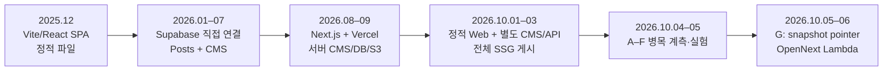
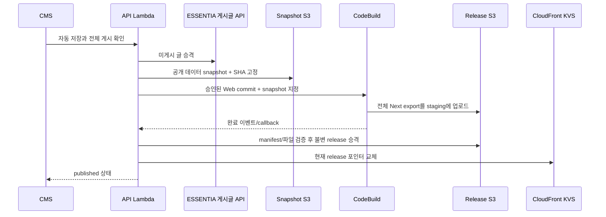
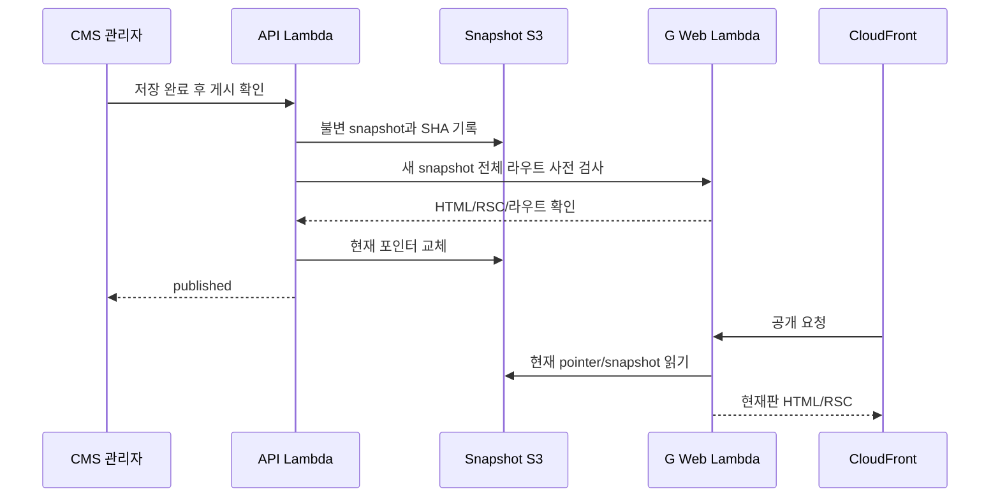

# ICAROS 웹 마스터 히스토리: 단일 React 앱에서 스냅샷 게시까지

**기준 시각:** 2026-10-06 KST

**확인 범위:** `ICAROS-web`의 Git 전체 참조, `ICAROS-api` Git, 2025–2026 코드·설계 문서·운영 실험 보고서, 이 대화의 요청·결정, 2026-10-06 운영 브라우저 E2E
**성격:** 개발사와 운영 의사결정의 기록. 시점이 다른 설계안과 실제 운영 구현을 구분한다.

> 이 저장소에는 운영 식별자와 실험 원자료를 싣지 않는다. 10월 A–G 실험 보고서·브라우저 화면 증거는 원래 Codex 작업의 로컬 `outputs/`에 보관되어 있으며, 아래에서 파일명으로 출처를 표기한다. 이 문서의 본문에는 판정에 필요한 측정 경계와 수치를 포함했다.

## 0. 지금의 결론

ICAROS 웹은 2025년 12월 **Vite 7 + React 19의 단일 SPA**로 Git 이력이 시작됐다. 2026년 1월 Supabase 게시글과 관리 UI가 붙고, 7월 CMS가 확대됐다. 8월에는 **Next.js 16 + TypeScript + PostgreSQL `icaros` 스키마 + private S3**로 재구축되어 Vercel에서 동적 사이트와 자체 관리자 화면을 운영했다. 9월의 DB 연결·미디어·지역 지연 문제가 공개 요청을 DB에서 분리하는 방향으로 이끌었다. 10월 1–3일에는 **정적 공개 Web, 별도 CMS, Lambda API, S3/CloudFront, CodeBuild**로 갈라졌고, CMS 게시마다 전체 정적 사이트를 다시 만들었다. 이 게시의 수분 단위 지연을 10월 4–6일 A–G 실험으로 추적했다. 최종 G는 **코드 배포와 콘텐츠 게시를 분리**하여, 콘텐츠 게시 때 검증된 snapshot 포인터를 교체하는 OpenNext Web Lambda로 운영 전환했다. 운영 CMS→공개 단일 실측은 **23.484초**, 뒤이은 브라우저 E2E의 게시·원복 첫 관측은 **27.115초·31.340초**다. [정적 배포 준비 기록](2026-10-03-release-readiness.md), **속도 실험 기록** (로컬 실험 기록: `icaros-publishing-700-to-23-seconds-history-2026-10-06.md`), **G 운영 기록** (로컬 실험 기록: `icaros-g-production-rollout-2026-10-05.md`), **브라우저 E2E** (로컬 실험 기록: `icaros-browser-e2e-2026-10-06.md`).



### 이 문서의 증거 등급

| 표기 | 의미 |
| --- | --- |
| **Git 확인** | 특정 commit의 소스·diff·시각으로 확인. 커밋은 코드 상태의 증거이지 그날 운영 배포의 증거는 아니다. |
| **운영 기록** | 당시 문서에 AWS/브라우저/DB 조회와 결과가 기록됨. 이번 문서 작성 중 동일 조작을 재실행한 뜻은 아니다. |
| **대화 결정** | 이 세션에서 사용자가 우선순위·실험·운영 배포 범위를 지정한 내용. |
| **미확인** | 당시 원자료가 없거나 운영 수치가 아직 쌓이지 않은 내용. 근사·가정·추론을 실측으로 승격하지 않는다. |

**범위 한계:** 이 저장소의 첫 root commit은 `138f39a`(2025-12-22 00:36 KST)다. 팀 사이트의 아이디어·디자인·콘텐츠가 그 전부터 있었을 수 있지만 이 Git 이력만으로 시작일을 확정하지 않는다. 최초 root commit의 제목은 `ver 2`이며, 뒤의 `7ed958c`가 `first commit`이라는 메시지를 썼다. **메시지의 표현과 실제 Git 최초 기록을 혼동하지 않는다.** 이 대화 이전의 별도 채팅 전체는 현재 대화와 저장된 문서에서 확인되는 범위만 반영했다.

## 1. 무엇을 만들고 있었나

ICAROS는 제주 중심 학생 항공우주 팀으로, 웹은 활동 기록, 기체·멤버 소개, 후원 안내를 공개하는 창구였다. 초기 페이지는 홈·로켓·멤버·갤러리였고, 2026년 1월 Posts, 이후 CMS 편집과 ESSENTIA Community 연동이 더해졌다. 웹은 단순 홍보 페이지에서 **콘텐츠를 수정·검증·게시·되돌리는 운영 시스템**으로 바뀌었다. 팀의 시뮬레이터는 별도 서비스 링크이고 이 저장소의 구현 범위는 아니다. [2026-08-23 초기 감사](icaros-rebuild/01-current-state.md), [프로젝트 안내](../AGENTS.md).

사용자가 10월에 명시한 판단 순서는 **① ICAROS로 인한 AWS 월 추가비용 ₩5,000 이하 ② 안정성 ③ 게시 속도 ④ 경력 기여**다. DB는 ESSENTIA의 기존 인프라와 공유하므로 신규 DB 고정비를 더하지 않는 전제였다. 희망 UX는 CMS 수정 후 대략 1–2분, 더 구체적인 탐색 목표는 한국에서 **20–40초**였다. 변경 때 Lambda가 필요한 코드를 만들어 S3/CloudFront에 반영하고, 현재+직전 2판만 보존하기를 원했다. 그러나 이 요구를 그대로 구현하는 것과 안전한 원복·정적 HTML의 일관성은 별도 문제였고, 실험 끝에 코드 생성보다 **콘텐츠 snapshot 교체**가 선택됐다. [대화: 2026-10-04~06], **실험 계획** (로컬 실험 기록: `icaros-overnight-experiment-plan-2026-10-05.md`).

## 2. 2025년 12월: 단일 React 웹의 출발

### 구조

`138f39a`의 `package.json`은 Vite 7, React 19.2, React Router 6, ESLint 9를 선언한다. `src/main.jsx`에서 SPA를 시작하며 `src/home.jsx`, `rocket.jsx`, `member.jsx`, `gallery.jsx`와 CSS 파일이 페이지를 이룬다. 서버 코드나 TypeScript 기반 API는 없었다. 이후 배포용 `dist/`와 `node_modules/`까지 Git에 추적된 상태였고, 2026-01-07 `f259cb1`, `8a54b57`에서 정리했다. 즉 저장소가 처음부터 깔끔한 소스 전용 구조였던 것은 아니다. [root commit](https://github.com/ESSENTIA-Science/ICAROS-web/commit/138f39a7aa09122a9ce8dc8ccd400675e5c85b92), [2026-08 초기 감사](icaros-rebuild/01-current-state.md).

2025-12-22의 9개 커밋은 UI 버전 반복, Netlify 설정, SPA redirect, 헤더 이동, 후원 문구 조정이다. `696a32d`가 `netlify.toml`을 추가했지만 `7ed958c`에서 제거됐고, 이후 `public/_redirects`가 남았다. 이 시기의 최종 실운영 호스팅을 commit만으로 단정하지 않는다. 확인 가능한 사실은 **Netlify 호환 설정을 시도했고, 나중에는 Vercel 설정도 더했다**는 것이다. [초기 Git 색인 §A].

사이트는 정적 React bundle을 브라우저가 받아 라우팅했다. URL별 완성 HTML이 없으므로 검색 메타데이터는 `index.html`의 공통 값이었다. 이 단순 구조는 빠르게 화면을 만들 수 있지만, 콘텐츠 편집·권한·게시 상태를 다룰 서버 경계가 아직 없었다.

## 3. 2026년 1–7월: Posts와 브라우저 직접 CMS

### 1월: Supabase와 게시글

1월 24일 `c5bffd0`은 갤러리 화면을 Posts로 교체하면서 `@supabase/supabase-js`, `src/lib/supabase.js`, `src/posts.jsx`, `src/admin.jsx`, 게시글 관리용 Supabase Edge Function을 추가했다. 같은 날 `439b04d`가 `vercel.json` SPA rewrite를 추가했다. 1월 말까지 로고·이미지 경로·외부 링크를 손봤다. 6월에는 저작권 문구, 7월 초에는 기존 작성자 표시를 수정했다. [1월 커밋](https://github.com/ESSENTIA-Science/ICAROS-web/commit/c5bffd05a7702f008c96d69235ab0d753b36b9f1).

### 7월: 네 영역을 편집하는 CMS

7월 15일 `08dd75a`는 Posts·Rockets·Members·Landing 편집을 `src/admin/*Panel.jsx`로 나누고, `site_content`, Markdown, Storage 도우미와 Supabase SQL migration을 넣었다. 관리자는 Supabase Auth 이메일/비밀번호로 로그인했고 `is_admin()` RPC와 Postgres RLS가 실제 읽기·쓰기 권한을 강제했다. 브라우저는 `supabase-js`로 PostgREST/Auth/Storage를 직접 호출했다. 관리 화면의 권한 토글은 UI 게이트이고 **실제 보안 경계는 RLS**였다. 7월 15일 `3e8595c`가 패널 비율을 조정했고 7월 27일 `adb6a41`은 홈 Hero를 고쳤다. [7월 CMS 커밋](https://github.com/ESSENTIA-Science/ICAROS-web/commit/08dd75a), [초기 감사](icaros-rebuild/01-current-state.md).

8월 23일 리뉴얼 착수 직전 감사의 라이브 수치는 게시글 **20건**, 기체 **4기**, 멤버 **27명**, 랜딩 텍스트 **18개 key**였다. 게시글 20건 중 13건의 요약은 예전 backfill 결과가 낡았고, 52개 Storage 객체 중 실제 본문 참조는 49개였다. 이미지는 변형 없이 원본을 카드에 쓰는 경우가 많았다. 로켓·멤버 이미지 일부는 Storage가 아닌 레포의 `/assets` 경로였다. 이 수치는 **2026-08-23 스냅샷**이며 현재 운영 수량이 아니다. [초기 감사](icaros-rebuild/01-current-state.md).

### 왜 다음 재구축이 필요했나

당시 폼 검증·파생 필드·파일 삭제 순서가 브라우저 코드에 있었다. Storage 객체와 DB 행을 하나의 트랜잭션으로 묶을 수 없었고, 동시 편집의 충돌 감지도 없었다. PostgREST를 직접 호출하면 UI 검증을 우회할 수 있는 DB CHECK 부재도 확인됐다. Git의 `.env.local` 추적 이력과 빌드 산출물 추적 문제도 있었다. 무엇보다 서버에서 콘텐츠, SEO HTML, 배포를 통제할 장소가 없었다. 이 한계는 8월 Next.js 재구축의 기술적 배경이며, 10월 게시 속도 이슈와는 별개의 단계다. [초기 감사 §3·8](icaros-rebuild/01-current-state.md).

## 4. 2026년 8월: Next.js 16 재구축과 첫 운영 장애

### 8월 23–25일: 설계 문서와 P1–P6 구현

`caeea77`은 Next.js 16 App Router, strict TypeScript, CSS Modules 기반 스캐폴드를 넣고, 구 Supabase 앱을 대체할 아키텍처·DB·인증·S3·이관 계획 문서를 한 번에 기록했다. `9f4e71d`는 `icaros` 전용 Drizzle schema, 홈·기체·멤버 공개 페이지, 인증·private S3 계층을 구현했다. `4e18cc9`가 Server Actions 기반 관리자 CMS를 추가했다. 페이지와 관리 기능을 한 앱에서 제공하는 **Vercel 서버 렌더링 시대**가 시작된 것이다. [P1](https://github.com/ESSENTIA-Science/ICAROS-web/commit/caeea77), [P2–P5](https://github.com/ESSENTIA-Science/ICAROS-web/commit/9f4e71d), [P6](https://github.com/ESSENTIA-Science/ICAROS-web/commit/4e18cc9), [당시 목표 아키텍처](icaros-rebuild/04-architecture.md).

데이터 소유권은 `public`을 ESSENTIA Flyway, `icaros`를 ICAROS migration이 맡는 방식으로 고정했다(D2). `drizzle-kit push`는 공유 DB에 부적절해 금지하고 `generate` + 자체 migration runner + 원장 검증을 사용했다. 공개 미디어는 private S3에서 `/api/media/[id]`가 가져왔다. 처음 고려한 302 presigned URL redirect는 Next 이미지 최적화와 맞지 않아 `3955a45`에서 바이트 스트리밍으로 바뀌었다(D15). 관리자는 자체 Argon2id + DB 세션, 공개 가입 없음이었다. 브라우저 업로드는 presigned PUT, 확인 단계에서 실제 파일 크기·타입을 읽어 검증했다. [결정 로그 D2–D15](icaros-rebuild/DECISIONS.md).

DB 접근 계획도 실제 ESSENTIA 인프라 변화에 맞춰 수정됐다. 8월 23일 ESSENTIA DB의 Neon→AWS RDS 이전으로 초기 D7 계획이 무효가 되었고(D16), ICAROS 데이터는 공유 RDS에 유지하되 접근 경로를 바꾸기로 했다(D17). 8월 24–25일에는 RDS IAM 인증과 Vercel OIDC, 전용 런타임·migration role, TLS 검증을 연결했다(D20). 공개 페이지에서 ESSENTIA Community는 서버측 읽기 어댑터로 합쳤다(D23). 이 결정은 **그 당시의 운영 경로**이며, 9월의 자체 호스팅 DB/PgBouncer 및 10월 Lambda 분리 후에도 모든 설정이 그대로 유지됐다는 뜻이 아니다. [결정 로그 D16–D23](icaros-rebuild/DECISIONS.md), [9월 운영 감사](ICAROS-WEB.md).

### 콘텐츠·디자인의 급격한 전개

8월 26–27일에는 `design/*` 브랜치에서 Flight Record, Specimen, 사람 중심 랜딩과 Observation/Basalt/Drafting/Achromatic 등 여러 디자인 언어를 병렬로 실험했다. Git 전체 467개 커밋 중 **8월 26일 203개, 27일 163개**가 집중되어 있다. 그러나 이 수는 디자인 브랜치·프로토타입까지 합친 것이며, 366개 기능이 운영에 따로 배포됐다는 뜻은 아니다. 이후 랜딩은 사진 패널 중심으로 정리되었고, 패널이 하나도 공개되지 않으면 기존 3D Hero·섹션으로 돌아가는 폴백을 만들었다. 흑백 공개 팔레트, 사진 중심 패널, 하위 페이지에 상세 데이터를 배치하는 선택이 이 시기에 굳어졌다. [Git 전체 색인 §A], [현재 repo 안내](../AGENTS.md).

로켓 3D 자산은 관리 schema·홈 Hero의 capability 검사/지연 로드가 있었지만, 9월 감사 시점 기체 상세에서 실제 3D viewer는 없었다. 따라서 “3D가 사이트 전역에서 완성됐다”는 서술은 틀리다. 화면과 관리 기능의 각 구현 단계를 구분해야 한다. [9월 감사](ICAROS-WEB.md).

### 8월 27–29일: 운영 전환, 데이터 구출, DB 피해

`4cb58cf`가 `rebuild/next16`을 `main`에 병합했다. 그전에는 Vercel의 production branch가 `main`인데 새 앱은 rebuild branch에 있어 CLI 수동 배포를 잊으면 옛 웹이 계속 서비스되는 위험이 있었다. 병합으로 그 간격을 줄였다. [병합 commit](https://github.com/ESSENTIA-Science/ICAROS-web/commit/4cb58cf), [repo 운영 안내](../AGENTS.md).

Supabase 글·사진 이관은 계획대로 곧바로 ESSENTIA Community에 넣지 못했다. 서비스 토큰과 상대쪽 쓰기 조건이 준비되지 않아, **19개 글 원본과 48개 이미지**를 ICAROS 소유의 `icaros.legacy_posts` 및 S3 보존본으로 옮겼다. 그중 중복 1건은 비공개로 두어 당시 공개는 18건이었다. 원본 날짜와 본문 URL을 보존·치환하고, 공개용 이미지는 별도 변형했다. 8월 28일에는 Supabase 원본이 사라졌음을 확인하고 18건·38장 아카이브 무결성을 다시 감사했다. 상류 글 이미지 2장 소실도 기록됐다. 이 숫자들은 단계가 달라 서로 모순이 아니다: **이관 원본 19건/48장**, **후속 특정 아카이브 감사 18건/38장**이다. [이관 실행 기록](icaros-rebuild/14-legacy-posts-migration.md), [후속 Git 색인 §A].

같은 시기 Vercel Fluid Compute 인스턴스가 공유 RDS에 직접 연결하면서 문제가 났다. 8월 27일 로그에는 ICAROS role의 커넥션 슬롯 고갈 FATAL **95건**, ESSENTIA role의 거부 **1건**이 남았다. 고유 ICAROS 클라이언트 IP는 63개였다. 이미지 프록시의 DB 조회를 캐시하고 이미지 변형 수를 40→25로 줄인 뒤, 1분 해상도 최대 연결 수가 **77→36**, ICAROS FATAL **95→0**으로 기록됐다. 두 수정의 효과를 각각 분리 측정하지는 못했다. `max:3→1`과 PgBouncer 추가는 당시 보류했다. 이어서 보안그룹의 좁은 인바운드가 간헐적 RDS timeout을 만들었고, 8월 28일 SSM 포트포워딩으로 로컬 관리 경로를 확보했다. 패널 사진을 미디어 참조 검사에서 빠뜨려 정리 cron이 살아 있는 사진을 삭제한 사고도 `e888bf2`에서 드러나, `db:verify`가 schema의 FK와 코드 목록을 대조하도록 고쳤다. [D26·D27](icaros-rebuild/DECISIONS.md), [인프라 부채](icaros-rebuild/15-infra-debt.md), [Git 색인 §A].

**교훈으로 남은 사실:** 공개 조회를 서버리스 DB 연결과 이미지 프록시 호출에 묶으면, 페이지 트래픽보다 함수 인스턴스 수와 이미지 변형 요청이 DB 연결을 증폭한다. 이 사고가 9월 이후 공개 페이지를 더 강하게 캐시하고, 결국 공개 요청을 DB에서 떼려는 방향에 직접적인 근거가 됐다.

## 5. 2026년 9월: Vercel 앱의 성숙과 구조적 한계

9월 6–7일에는 랜딩 패널 영상, 공개 기체 분류 확대, 멤버 소개, 후원 차수, 사이트 점검 셔터, 홈·멤버의 edge cache와 배포 후 revalidation hook을 추가했다. 코드만 놓고 보면 Next.js의 요청 시 렌더·ISR/캐시를 조합한 단계였다. 배포 당시 실제 라우트는 `/`, `/vehicles`, `/vehicles/[slug]`, `/posts`, Community·legacy 상세, `/member`, `/admin`으로 넓어졌다. [9월 커밋들: `3d862a6`, `cb85b51`, `1b135a9`, `beb69ae`], [9월 감사](ICAROS-WEB.md).

9월 20일 감사의 관측은 코드 문서와 운영이 어긋날 수 있음을 보여줬다. `icaros.kr`은 `www`로 307 이동했고 canonical은 apex였으며, Vercel edge는 서울이지만 함수는 버지니아였다. 운영 응답에는 로컬의 미푸시 commit을 가리키는 셔터 헤더가 있었고, 기본 브랜치가 실제 배포 소스를 온전히 설명하지 못했다. 당시 DB 설정 메모에는 9월 6일 자체 호스팅 EC2+PgBouncer로 옮긴 뒤 password 모드라는 단서가 있었지만, 8월 RDS+IAM 결정 문서에는 반영되지 않았다. Community 글 상세가 HTTP 500이고 robots/sitemap/manifest가 404인 것도 당시 관측이다. 이 값들을 10월 새 AWS 사이트의 현재 장애로 가져오면 안 된다. [9월 20일 전체 감사 §2](ICAROS-WEB.md).

공개 사진은 `/api/media`와 Next 이미지 최적화 경유로 전송되고, 공개 페이지 생성도 일부 DB·ESSENTIA API에 의존했다. 서버 지역, 공유 DB 연결, 이미지 프록시, 빌드 소스와 운영 코드 불일치가 누적되었다. 9월 30일의 아키텍처 설계는 **공개 HTML을 정적 파일로 만들고 S3·CloudFront에서 전달**, CMS만 Lambda API로 DB에 접근하게 하는 방향을 선택했다. 당시 설계 문서는 “최종 권장 설계안(구현 전 검증 필요)”이었다. 실제 10월 구현과 같다고 소급해서 읽으면 안 된다. [9월 30일 설계](../ICAROS-web-architecture.md).

## 6. 2026년 10월 1–3일: 정적 웹·CMS·API 분리

### 코드와 책임의 분리

10월 1일 `c70e921`은 루트 `src/` Next 앱을 `legacy/`로 보존하고 npm workspace의 `apps/web`(Next.js static export), `apps/cms`(React/Vite 정적 관리자 UI), `packages/contracts`로 분리했다. 처음에는 `services/api`도 Web 저장소 안에 만들었으나, `ICAROS-api`가 같은 날 `b3c7b6f`로 **형제 저장소로 분리**됐다. 이 때문에 9월 30일 설계서의 “한 GitHub 저장소, 세 배포 단위”는 최종 구현 설명이 아니다. 최종 책임은 공개 Web/CMS 코드가 `ICAROS-web`, 관리자 API·snapshot·게시 orchestration이 `ICAROS-api`, ESSENTIA Community는 독립 소유다. [분리 commit](https://github.com/ESSENTIA-Science/ICAROS-web/commit/c70e921), [API 초기 commit](https://github.com/ESSENTIA-Science/ICAROS-api/commit/b3c7b6f), [API README](https://github.com/ESSENTIA-Science/ICAROS-api/blob/refactor/repo-split-cognito/README.md).

관리 인증도 자체 비밀번호 세션에서 **Cognito managed login authorization code + PKCE**로 바뀌었다. API는 token의 issuer/client/서명/이메일 검증/관리자 그룹을 확인하고, 첫 로그인 그룹 구성원을 `icaros.admin_users`에 연결한다. 관리자 세션은 HttpOnly다. 공개 가입은 없다. 기존 비밀번호 로그인 경로는 운영 Lambda에서 닫혔다. 10월 3일에는 계정 매핑·초기 로그인 문제가 나와 계정 상태와 자동 등록 로직을 고쳤다. [API 인증 문서](https://github.com/ESSENTIA-Science/ICAROS-api/blob/refactor/repo-split-cognito/README.md), [배포 준비 기록](2026-10-03-release-readiness.md), [API commit `2d734d8`].

### 첫 AWS 운영 구성

10월 3일 `icaros.kr`·`www`는 공개 CloudFront, `cms.icaros.kr`은 CMS CloudFront, `media.icaros.kr`은 공개 미디어 CloudFront를 가리켰다. 공개 정적 사이트는 private S3 release와 CloudFront OAC, URL rewrite/릴리스 선택은 CloudFront Function + KeyValueStore(KVS)를 사용했다. CMS API는 API Gateway HTTP API→Lambda이며 ICAROS 스키마를 읽고 ESSENTIA 서비스 API와 통신했다. CMS의 0.7초가량 debounce 자동 저장은 **DB 초안 저장**이고 공개 반영은 우측 상단 “변경사항 반영하기”의 별도 단계다. 버튼은 저장·업로드 flush와 실패 검사를 마친 뒤 단일 전체 게시 job을 시작한다. [CMS 편집 흐름](cms-editing-workflow.md), [배포 준비 기록](2026-10-03-release-readiness.md).



이 구조에서 **CodeBuild 성공 ≠ 공개 완료**다. 빌드의 staging manifest와 모든 파일을 검증한 뒤 불변 release로 승격하고 KVS `release` pointer를 바꿔야 한다. 공개 전 실패면 기존 release를 계속 제공한다. CMS 변경은 파일 한 부분 수정이어도 전체 snapshot과 전체 정적 사이트를 다시 만든다. URL별 HTML·RSC·metadata·sitemap·자산 참조의 일관성을 위해 그렇게 설계했지만, 이 비용이 게시 대기 시간으로 드러났다. [릴리스 runbook](icaros-release-runbook.md), [10월 4일 리뷰](2026-10-04-publishing-architecture-review.md).

10월 3일 첫 두 전체 게시에서는 CodeBuild 완료 이벤트 ARN 검증과 빈 KVS pointer 처리 오류가 실제로 드러나 `62afc6c`, `9b236c9`로 고쳤다. 첫 로그인 매핑과 프록시 fetch도 수정했다. 당시 운영 snapshot에는 기체 6기, 글 37개, 멤버 29명, 참조 미디어 79건이 들어갔다. Supabase 시대의 19개 `icaros.legacy_posts` 원본은 삭제하지 않고, 10월 3일 ESSENTIA에 이관된 18개 공개 원본은 중복 방지를 위해 비공개로 전환했다. 이 수치는 8월의 19개/18개 공개와 다른 시점의 상태다. [배포 준비 기록](2026-10-03-release-readiness.md), [10월 4일 리뷰 §콘텐츠 소유권](2026-10-04-publishing-architecture-review.md).

## 7. 10월 4일: 느린 게시의 실제 병목

사용자는 당시 구조를 “Netlify/Vercel의 배포 시스템을 노코드 CMS로 직접 구현한 것”이라고 규정했다. 핵심 질문은 **콘텐츠 한 건을 바꿔도 매번 배포 시스템 전체를 돌려야 하느냐**였다. 먼저 현재 프로세스를 전수 설명하고 유사 사례와 비교한 뒤, 비용→안정성→속도 순서로 방법을 탐색했다. [이 대화의 2026-10-04 요청 연속], **아키텍처 아틀라스** (로컬 실험 기록: `icaros-publishing-architecture-atlas.html`).

### 이번 대화에서 요구가 구체화된 순서

| 대화 단계 | 사용자의 지시·수정 | 그 뒤의 설계·실험 영향 |
| --- | --- | --- |
| 10월 4일 시작 | 저장소 문서와 전체 구조를 읽고, 유사 아키텍처를 찾으며 현재 게시를 빠짐없이 설명 | Web·API·AWS의 데이터 소유권, CMS 저장과 게시, CodeBuild·S3·CloudFront/KVS를 분리해 추적 |
| 목표 구체화 | CMS 요소 수정→Lambda 빌드→S3/CloudFront 최신화→오래된 3판 삭제, 처음엔 1–2분·비용 0에 관심 | 실제 `essentia` AWS 계정의 증분 비용과 보존 정책을 별도 합격 항목으로 둠 |
| 우선순위 확정 | 추가 비용 월 ₩5,000 이하가 0순위, 안정성·속도·경력 기여 순 | 단순 최단시간이 아닌 원복과 비용까지 함께 비교 |
| 설계 공간 확대 | Lambda를 반드시 유지할 필요는 없고, 웹 SSG와 일시적 서버리스 게시라는 큰 틀만 유지 | CodeBuild source·이미지, Lambda 전체 SSG, 선택 SSG, ISR snapshot 등 A–G로 확장 |
| 야간 실험 승인 | 오전 8시, 이후 10시까지 최대한 실제 시험. 운영 사용과 게시·원복 허용 | 테스트 멤버·UAV 사례, 원복 시각, AWS 원자료, 비용·안정성 기록 생성 |
| B 이후 질문 | “160초가 결론인가?”, “한국에서 20–40초 구조”, “F/G도 실제로 재보라” | Mac의 빠른 F 수치를 운영 AWS 계정 CodeBuild로 다시 재고 G 원복도 표준 경로로 확인 |
| 최종 선택 재검토 | 초기 B 추천에 대해 F/G의 잠재적 이점을 재질문, G를 재검증하고 실제 사례 조사·운영 적용 지시 | cache namespace 경합 해결, G 운영 배포, 브라우저 E2E까지 진행 |

비교에 사용한 사례·공식 패턴은 시기별로 달랐다. 9월 30일에는 AWS의 S3+CloudFront 정적 사이트, CMS→정적 빌드 사례, Contentful/ISR 사례를 설계 근거로 조사했다. 10월에는 AWS CodePipeline·CloudFront blue/green·S3 조건부 쓰기와 Next static export를 기존 A/B 구조의 근거로 대조했고, G 단계에서는 OpenNext/SST의 Lambda+CloudFront+S3 구성, CMS 변경 후 revalidation을 사용하는 실제 개발 사례를 검토했다. **사례의 속도·비용 숫자를 ICAROS 성능으로 전용하지 않았다.** [9월 30일 조사](../ICAROS-web-architecture.md), [10월 4일 참조 비교](2026-10-04-publishing-architecture-review.md), **G 참조 근거** (로컬 실험 기록: `icaros-g-production-rollout-2026-10-05.md`).

10월 4일 운영 CodeBuild 성공 7건의 phase 합계는 **319–484초, 중앙값 387초**였다. 이 중 Next 빌드 로그는 **18.1–22.1초, 중앙값 20.1초**였고, Next 완료→staging 완료가 **265.5–355.6초, 중앙값 276.2초**였다. 그 구간은 export 후처리·공유 자산·업로드를 함께 포함한다. 당시 코드에는 대략 366–371개 파일마다 AWS CLI 프로세스를 동기 실행하는 전송 루프가 있었다. 느린 완료 callback 두 건은 46.21–46.60초였다. S3/KVS 작업을 DB 게시 행 잠금 안에서 수행해 CMS 상태 조회가 30초 timeout을 낸 사례도 2건 확인했다. 빌드 성공, 최신 게시에 의해 대체된 job, callback 대기, 상태 조회 timeout은 서로 다른 현상이다. [10월 4일 운영 리뷰](2026-10-04-publishing-architecture-review.md).

초기 “약 700초”는 사용자 체감의 회고값이다. **정확히 700.000초를 잰 원자료는 확인되지 않았다.** 운영 A 재측정은 대략 7–10분이었고, 무변경 게시의 첫 공개 관측 상한 497초가 남아 있다. 따라서 `700→160→104→23`은 개선 탐색의 시간순 제목으로 읽을 수 있지만, 동일 측정 구간의 연속 벤치마크 그래프로 그릴 수 없다. **측정 경계 정리** (로컬 실험 기록: `icaros-publishing-700-to-23-seconds-history-2026-10-06.md`).

## 8. 10월 5일: A–G 후보를 실제로 비교한 과정

사용자는 야간 시험에 운영 환경 사용을 허용했고, 신규 UAV와 부서 이동 같은 실제 CMS 사례를 요구했다. 모든 과정을 문서화하고 오전 8시, 이후 10시를 상한으로 삼되 안정성·비용·시간을 함께 판정하도록 했다. 진행 중 GitHub 실험 브랜치 push와 운영 Lambda 임시 교체·게시·원복도 구체 범위로 승인했다. 이 권한은 **당시 실험에 대한 승인**이며, 이후 모든 변경의 무기한 승인으로 해석하지 않는다. [이 대화 2026-10-04~05], **실험 상세 계획** (로컬 실험 기록: `icaros-overnight-experiment-spec-2026-10-05.md`).

### 후보별 증거와 결정

| 후보 | 구조 | 실제 검증 | 판단과 제한 |
| --- | --- | --- | --- |
| **A** | 기존 전체 SSG, 파일별 순차 전송·callback, KVS 전환 | 운영 게시 약 7–10분; 무변경 첫 공개 상한 497초; 시험 멤버 게시·이동·원복 | 안전한 release 경계는 있었지만 수분 지연. 신규 UAV 생성은 다른 slug 두 번 모두 `CONFLICT`로 실패하여 해당 CMS 경로는 게시 실측 못 함. |
| **B** | 전체 SSG 유지, S3 staging·검증·승격을 제한된 병렬 I/O로 변경 | 운영 CMS→공개 **160.2초**, 원복 **131.0초**; 371개 파일 격리 업로드 2.612초; CodeBuild 91.4/88.0초 | 기존 release 무결성을 유지하며 큰 병목을 제거했으나 120초 목표 미달. 운영 시험 후 기존 Lambda로 복원. |
| **C** | Git checkout 대신 S3 ZIP source, 또는 `NO_SOURCE` CodeBuild | 빌더 106.5초 / C′ 118초 / C″ 76.0초 | 빠른 C″도 CMS→공개가 아니다. 76초에 나머지를 더한 약 145초는 **추정**. |
| **D** | 의존성을 담은 사전 준비 CodeBuild 이미지 | 로컬 이미지 작업, AWS 실행 없음 | IAM 승인·Docker 문제로 속도 미검증. 느리다고 결론 내리지 않음. |
| **E** | Lambda 컨테이너에서 전체 Next SSG | 로컬 빌드 가능성만 확인, AWS 호출 없음 | 비용·수명·`/tmp`·실행 시간 미검증. |
| **F** | 변경 경로만 Next SSG, 기존 정적 release와 합성, KVS 전환 | Mac→서울 CDN 28.02/39.03초. 운영 AWS 계정의 임시 CodeBuild→CDN **101.708초(멤버), 114.891초(UAV)** | CMS 구간이 빠짐. Next debug 선택 빌드 출력 합성·RSC/chunk 차이와 S3 sync의 같은 크기 파일 24개 누락을 검증 단계에서 발견. 운영 채택 안 함. |
| **G 초기** | OpenNext/ISR, snapshot pointer + 표준 revalidation | 임시 CDN 게시 중앙값 3.642초(멤버), 4.744초(UAV), 각 5/5 왕복 | **S3 pointer PUT 이후 CDN** 시간이며 CMS 종단 아님. 즉시 Function URL 원복 1회에서 캐시가 55초 이상 잔류해 운영 전환 보류. |
| **G 수정** | snapshot SHA별 cache namespace + 불변 snapshot·전체 라우트 사전 검사·포인터 공개 | 격리 반복/원복, 운영 v18 CMS→공개 **23.484초**, 브라우저 E2E +27.115/+31.340초 | 운영 채택. 지역·p95·월 청구는 아직 미검증. |

세부 원자료: **A–E 야간 기록** (로컬 실험 기록: `icaros-overnight-results-2026-10-05.md`), **F/G 초기 격리 실험** (로컬 실험 기록: `icaros-fg-measurement-2026-10-05.md`), **B/F/G 운영 계정 비교** (로컬 실험 기록: `icaros-bfg-production-account-decision-2026-10-05.md`), **G 운영 기록** (로컬 실험 기록: `icaros-g-production-rollout-2026-10-05.md`).

### B가 잠시 추천안이었다가 G로 바뀐 이유

B는 당시 실제 CMS→운영 공개와 원복을 성공시킨 유일한 후보였고 160.2초를 입증했다. 계획 시나리오의 월 60회 게시 비용은 약 **₩4,220**이었지만 청구 실측은 아니었다. F는 CodeBuild 제출만으로 102–115초여서 CMS 구간을 더하면 120초에 닿기 어려웠고, 합성 무결성도 복잡했다. 초기 G는 게시 자체가 3–5초여도 **즉시 원복이 실패**했으므로 안정성 우선순위에서 보류됐다. 사용자가 “왜 F/G를 안 하느냐, B보다 낫다”고 재질문한 뒤 G의 캐시 경쟁을 다시 분석·수정하고 운영 종단 검증을 진행했다. **B 선택 기록은 그 시점의 판정이고, 이후 G 채택이 최종 판정**이다. **당시 비교** (로컬 실험 기록: `icaros-bfg-production-account-decision-2026-10-05.md`), **최종 G** (로컬 실험 기록: `icaros-g-production-rollout-2026-10-05.md`).

### 사용자 희망안과 최종 구현의 차이

처음 구상은 “CMS 요소 수정 → Lambda에서 소스 일부 수정·빌드 → S3 업로드 → CloudFront 최신화 → 3버전 전 삭제”였다. 실제 Next 정적 출력은 페이지 HTML뿐 아니라 RSC, chunk, metadata, sitemap, 라우트 존재 여부가 묶인다. 소스 파일의 일부분을 Lambda에서 고쳐 S3 객체 몇 개만 바꾸면 누락·혼합 버전의 위험이 있다. F가 바로 그 합성 복잡성을 실측했다. G는 **소스 변경이 필요한 날만 Web 코드를 배포**하고, 평상시 CMS 변경은 Web Lambda가 읽는 검증된 데이터 버전을 교체한다. 외형상 “노코드 Vercel”에 가까운 CMS 게시 경험은 유지하되, 매 게시마다 플랫폼 전체 빌드를 반복하지 않는 구조다. [9월 설계](../ICAROS-web-architecture.md), **F/G 판정** (로컬 실험 기록: `icaros-bfg-production-account-decision-2026-10-05.md`).

## 9. 10월 5–6일: G 운영 전환과 실제 장애 복구

### 운영 G의 공개 경계

G의 Web 코드 commit은 `6b582c1`, 운영 DB 호환 API commit은 `ce0d271`이다. Web은 OpenNext 기반 Lambda에서 Next.js를 실행하고, API는 CMS 게시 시 ESSENTIA·ICAROS 공개 데이터를 snapshot으로 고정한다. 변경 snapshot을 S3에 불변 객체로 저장하고 SHA-256을 검증한다. **새 snapshot의 모든 공개 라우트**를 사전 조회한 뒤 완료 이벤트와 버전 상태를 확인한다. 마지막에 S3의 작은 현재 snapshot 포인터를 교체한다. 공개 요청은 CloudFront→비공개 Lambda Function URL(OAC·AWS_IAM)→해당 snapshot의 HTML/RSC로 이어진다. 일반 공개 경로만 G origin으로 바꾸고 `/admin*`, `/api*`는 기존 경로를 유지했다. [G Web 소스](https://github.com/ESSENTIA-Science/ICAROS-web/blob/6b582c1/apps/web/src/lib/content/snapshot.ts), [G API 소스](https://github.com/ESSENTIA-Science/ICAROS-api/blob/ce0d271/src/publication-runtime/g-aws.ts), **운영 기록** (로컬 실험 기록: `icaros-g-production-rollout-2026-10-05.md`).



초기 G에서 발견한 원복 경합은 **snapshot SHA를 ISR cache key의 namespace에 포함**해 해결했다. 게시판 A의 늦은 cache write가 B 또는 원복 A의 응답을 덮지 못하도록 버전을 분리한 것이다. 운영 전 Web 38개, 프록시 ACL 29개, API 216개 테스트와 lint/typecheck/build가 통과했다. 격리 AWS에서는 예열·새 SHA·CDN 왕복을 각각 10회씩 실행하고 60개 라우트를 사전 검사했다. 이는 캐시 일관성 증거이며 운영 CMS 버튼부터의 30회 속도 표본은 아니다. **운영 기록 §코드와 검증** (로컬 실험 기록: `icaros-g-production-rollout-2026-10-05.md`).

### 두 운영 장애를 거쳐 완성

첫째, 최신 API 브랜치가 아직 운영 DB에 없는 `member_departments` 테이블을 요구해 CMS 멤버 목록이 **503**이 됐다. G 변경만 기존 운영 schema에 이식한 API를 재배포해 30명 목록을 복구했다. 둘째, 첫 운영 게시 v17은 snapshot과 60개 라우트 사전 검사를 완료했지만 `publishing`에 머물렀다. API Lambda의 비동기 완료 호출이 공유 ESSENTIA HTTPS 프록시의 허용 호스트 목록에 막힌 것이다. 프록시의 목적지 제한을 유지하면서 서울 Lambda API 호스트를 추가·검사했고, v17의 snapshot·사전 검사 결과를 다시 확인한 후 설계된 완료 이벤트를 재전달해 게시를 끝냈다. 다음 v18은 **수동 재전달 없이** 실제 CMS 버튼으로 정상 완료됐다. 이 두 장애는 G가 처음부터 무결점이었다는 서사를 막는 중요한 기록이다. **G 운영 기록 §운영 중 발견·해결한 문제** (로컬 실험 기록: `icaros-g-production-rollout-2026-10-05.md`).

v18에서 관리자의 게시 확인 버튼은 **2026-10-06 00:28:25.896 KST**, 공개 `/member/`의 새 snapshot 첫 관측은 **00:28:49.380 KST**로 차이 **23.484초**였다. S3 현재 포인터 `LastModified`는 00:28:48이었다. 뒤이은 홈·멤버·기체·글·활동·sitemap·robots·HTML/RSC의 12/12 요청은 HTTP 200과 같은 v18 SHA를 보였다. 관측 POP은 미국 `SEA900-P9` 및 `LAX54-P12`였으므로 한국 POP에서 23초라고 주장하지 않는다. 실험용 멤버는 원래 이름과 비공개 상태로 복원됐다. **G 운영 실측** (로컬 실험 기록: `icaros-g-production-rollout-2026-10-05.md`).

이후 10월 6일 앱 내 브라우저 E2E에서 공개 홈/기체/멤버 방문, Cognito 로그인, CMS 사이트 설정 자동 저장, 전체 게시, 공개 푸터 변경, 원문 복원·재게시까지 실제 UI로 확인했다. 첫 공개 관측은 게시 **+27.115초**, 원복 **+31.340초**다. 두 값은 polling으로 처음 본 시각이고 정확한 edge 전파 시각이 아니다. 후속 공개 홈은 HTTP 200과 원복 SHA를 보였고 CMS는 “모든 변경사항 반영됨”이었다. Chrome 확장 연결은 시간 초과되어 Codex 앱 내 브라우저를 사용했다. 다른 관리자 계정이나 한국 POP의 E2E는 실시하지 않았다. **브라우저 E2E** (로컬 실험 기록: `icaros-browser-e2e-2026-10-06.md`).

### Git과 운영이 아직 어긋난 지점

G 운영용 Web·API 코드는 원격 실험 브랜치에 push되었으나, **기본 브랜치에 병합되지 않았다.** 기존 Web 원본 checkout의 `main`과 원격 `origin/main`, 10월 3–4일 release branch, G 실험 브랜치는 서로 다른 상태다. API도 운영 호환 G 브랜치와 더 최신 schema를 기대하는 별도 브랜치를 구분해야 한다. 지금 운영 사이트가 작동한다는 사실과 “다음 기본 브랜치 배포가 안전하다”는 명제는 다르다. 실제 배포 소스 고정 및 호환 schema 확인이 후속 릴리스의 필수 조건이다. **G 운영 기록** (로컬 실험 기록: `icaros-g-production-rollout-2026-10-05.md`), [Git 참조 조사 §A].

## 10. 속도·비용·안정성의 정확한 판정

| 항목 | 확인한 것 | 아직 주장할 수 없는 것 |
| --- | --- | --- |
| **속도** | B의 운영 CMS→공개 160.2초, G의 운영 CMS→공개 23.484초. 이후 브라우저 UI 변경·원복 첫 관측 27.115/31.340초. | 한국 POP의 반복 중앙값·p95·최댓값, 모든 방문자의 동시 공개, 20–40초 SLA. |
| **A≈700초** | 당시 체감값과 A 재측정 7–10분, 무변경 첫 공개 관측 상한 497초. | 정확한 700.000초 종단 raw 측정. |
| **F≈104초** | 운영 AWS 계정 임시 CodeBuild 제출→임시 CDN 101.708/114.891초. | CMS→운영 `icaros.kr` 종단 104초. |
| **비용** | G는 콘텐츠 게시마다 CodeBuild 분 요금을 내지 않는다. 대신 공개 요청의 Lambda/S3/캐시/로그 사용량이 생긴다. B의 ₩4,220/월은 60회 게시 **계획 계산**. | G의 실제 월 증분 청구 ₩5,000 이하. 월 요청량·cache hit·로그·S3 버전 보존 비용을 분리한 청구 자료가 없다. |
| **원복** | G 격리 반복과 운영 v17→v18, 브라우저 UI 변경·복원 확인. | 운영 수십 건 누적 실패율, 모든 edge에서 즉시 원복 보장. |
| **보존·삭제** | 과거 정적 release와 snapshot은 참조 무결성 때문에 유지. | “3버전 전 자동 삭제” 완료. 기존 S3 Versioning과 삭제 거부 정책상 별도 보존·VersionId 정리 설계가 필요. |

비용은 이 프로젝트에서 **가장 높은 우선순위**다. G의 예시 요금 계산은 실제 월 청구가 아니며 Lambda 실행 외에 CloudFront, S3 GET/PUT/저장, DynamoDB/SQS가 남는 구성의 경우 캐시, CloudWatch 로그, 세금·환율, 기존 AWS 무료 구간의 공유 상황까지 합산해야 한다. “월 ₩5,000 통과”는 아직 **미판정**이다. 이미 ESSENTIA EC2/DB를 쓰는 부분은 이 프로젝트의 신규 고정비로 이중 계산하지 않는다. **B/F/G 비용 판정** (로컬 실험 기록: `icaros-bfg-production-account-decision-2026-10-05.md`), **G 비용 판단** (로컬 실험 기록: `icaros-g-production-rollout-2026-10-05.md`).

## 11. 시대별 아키텍처 비교

| 시기 | 공개 요청의 실행 위치 | CMS 쓰기·인증 | 콘텐츠 공개 경계 | 주요 대가 |
| --- | --- | --- | --- | --- |
| 2025.12 초기 SPA | 브라우저의 Vite/React bundle | CMS 없음 | 소스·정적 bundle 배포 | 편집 기능·서버 권한 경계 부재 |
| 2026.01–07 Supabase SPA | 브라우저 + Supabase PostgREST | Supabase Auth/RLS, 클라이언트 폼 | DB row/Storage 변경이 곧 데이터 노출 | SEO HTML·트랜잭션·서버 검증 한계 |
| 2026.08–09 Next/Vercel | Next 서버 함수/ISR + DB/S3 프록시 | 자체 Argon2id/DB 세션·Server Actions | DB 저장 + `revalidatePath`/캐시 | 공유 DB 연결 fan-out, 지역 왕복, 운영·코드 불일치 |
| 2026.10.03 정적 A | S3·CloudFront | Cognito + API Lambda | 전체 SSG release와 KVS pointer | 콘텐츠 한 건에도 전체 빌드·파일 운송 |
| 2026.10.05 B/F 시험 | 정적 S3·CloudFront | 위와 동일 | 검증된 불변 release와 KVS pointer | B는 ~160초, F는 선택 출력 합성 위험 |
| 2026.10.05–06 G 운영 | CloudFront + OpenNext Web Lambda + S3 snapshot | Cognito + API Lambda | 전체 라우트 검증 뒤 현재 snapshot pointer | 빠른 게시, 대신 요청 실행비·cache/원복 설계 필요 |

기술적 핵심 변화는 **“정적 웹 대 동적 웹”** 한 문장이 아니라, *무엇을 언제 계산하고 어디서 원자적으로 공개하는가*다. 첫 SPA는 콘텐츠 DB를 브라우저가 바로 읽고, Vercel 앱은 공개 요청이 서버 데이터 계층에 닿았다. A/B/F는 편집 때 완성 파일을 만들어 포인터로 공개했다. G는 코드 자체를 배포해 둔 뒤 편집 때 데이터 snapshot을 공개하고 요청 시 완성 HTML을 낸다. G는 여전히 SEO 첫 HTML을 서버에서 제공하며, CMS 변경을 브라우저 JSON 패치만으로 처리하지 않는다.

## 12. 남은 운영 과제와 이 기록의 종점

1. **월 비용을 실제로 판정한다.** G 전환 전후의 Web Lambda 요청·duration, S3 읽기/쓰기·저장, 캐시 계층, CloudWatch 로그와 CloudFront 증분을 분리해 ₩5,000 한도와 대조한다. 비용 상한을 넘으면 캐시 적중률과 원본 호출량부터 조정한다.
2. **코드 정본을 운영과 맞춘다.** G Web `6b582c1`, 운영 schema 호환 API `ce0d271`을 기준으로 브랜치와 배포 절차를 리뷰하고, 다음 자동 배포가 예전 정적 버전 또는 미적용 DB schema 전제 API를 올리지 않도록 한다.
3. **한국 경로와 반복 분포를 잰다.** CMS 확인부터 한국 CloudFront POP의 HTML/RSC/sitemap 첫 변경까지 여러 건, 게시와 즉시 원복 모두 측정한다. 지금 수치들은 단일 운영 게시 또는 미국/유럽 POP 및 앱 내 브라우저 관측이다.
4. **snapshot/release 보존과 개인정보 철회를 완성한다.** 현재판·직전 성공판·열린 job과 공유 해시 자산을 보존하고, 실제 S3 VersionId까지 정리하는 별도 안전 정책을 만든다. 비공개 멤버 사진이 옛 release로 재노출되는지 확인한다. 삭제 작업의 성공을 게시 완료의 필수 경로에 넣지 않는다.
5. **게시 실패를 감시한다.** 비동기 완료 이벤트 유실, DB job 상태와 pointer 불일치, DLQ 신규 유입, 장시간 `publishing`, G cache 원복 경쟁을 같은 job/version으로 추적한다.

**2026-10-06의 종점:** 운영 G는 실제 CMS UI에서 게시·원복까지 동작했고 시험 문구는 제거됐다. 동시에 월 증분 비용, 한국 p95, 자동 보존, 기본 브랜치와 운영 코드 정렬은 미완료다. 이 문서는 그 상태를 완료로 꾸미지 않는다.

## 13. 핵심 근거와 읽는 순서

1. **Git:** 아래 §A의 Web 전체 467개 커밋, API 기본 이력 13개, G Web/API 실험 branch 추가 commit. Git 기록은 코드 변경의 정본이다.
2. **2026-08-23 현행 감사:** [01-current-state](icaros-rebuild/01-current-state.md) — React/Supabase 원본, 라이브 수량, 구조 결함.
3. **8월 재구축의 결정:** [DECISIONS](icaros-rebuild/DECISIONS.md), [인프라 부채](icaros-rebuild/15-infra-debt.md), [레거시 글 이관](icaros-rebuild/14-legacy-posts-migration.md).
4. **9월 운영 상태:** [ICAROS-WEB 전체 감사](ICAROS-WEB.md), [9월 30일 목표 설계](../ICAROS-web-architecture.md). 앞 문서는 관측이고 뒤 문서는 당시의 제안이다.
5. **첫 AWS 운영:** [10월 3일 배포 상태](2026-10-03-release-readiness.md), [CMS 저장·게시 흐름](cms-editing-workflow.md), [릴리스 runbook](icaros-release-runbook.md).
6. **병목과 후보:** [10월 4일 리뷰](2026-10-04-publishing-architecture-review.md), **A–E 결과** (로컬 실험 기록: `icaros-overnight-results-2026-10-05.md`), **F/G 측정** (로컬 실험 기록: `icaros-fg-measurement-2026-10-05.md`), **B/F/G 판정** (로컬 실험 기록: `icaros-bfg-production-account-decision-2026-10-05.md`), **700→23 상세 연대기** (로컬 실험 기록: `icaros-publishing-700-to-23-seconds-history-2026-10-06.md`).
7. **최종 운영 증거:** **G 운영 배포** (로컬 실험 기록: `icaros-g-production-rollout-2026-10-05.md`), **브라우저 E2E** (로컬 실험 기록: `icaros-browser-e2e-2026-10-06.md`). 날짜별 보고서는 해당 시점의 상태를 설명하므로 오래된 “현재” 판정을 최신 판정으로 사용하지 않는다.

## A. Git 전체 변경 색인

아래 색인은 `git log --all --date-order`의 **커밋일(KST offset이 기록된 Git author/committer 날짜를 날짜로 표시)**, short SHA, 원문 제목이다. 모든 branch의 commit을 중복 없이 열거한다. 커밋 제목은 당시 작성자가 쓴 표현이며, 운영 반영·검증의 증거가 아니다. 상세 diff는 SHA를 Web/API 저장소에서 조회한다. 8월 디자인 실험의 수백 개 미세 조정도 빠뜨리지 않기 위해 전문을 싣는다. `--date-order`는 부모 관계를 지키는 표시 순서이고 같은 날의 실제 작업 순서를 제목만으로 판단하지 않는다.

### A1. ICAROS-web: 전체 Git commit

```text
2026-10-04 3a17f2a Consolidate CMS publishing architecture and incident review
2026-10-04 1166a3b Document publishing bottlenecks and release redesign
2026-10-04 365edb2 게시 파이프라인 개선 계획과 운영 알림 구성
2026-10-04 7938ce9 게시 핫픽스 운영 적용 결과 기록
2026-10-04 fba3672 CMS 멤버 다중 부서 편집과 게시 안내 개선
2026-10-03 73f7297 Cognito 관리자 계정 권한 복구 기록
2026-10-03 c0f15d8 Cognito 관리자 계정 재설정 상태 기록
2026-10-03 d41611e 배포 전환 검증 상태 기록
2026-10-03 d359bb6 시험 런타임 동시 실행 및 미디어 이관 설정 보정
2026-10-03 747bfd6 정적 웹 배포 준비와 CMS 게시 흐름 정리
2026-10-01 c70e921 정적 웹 분리와 CMS API 게시 흐름 통합
2026-09-20 8bf150b On main: cmux last turn baseline
2026-09-20 f2ab043 index on main: 91cbf0d 점검 셔터에 진단 헤더를 붙인다
2026-09-07 91cbf0d 점검 셔터에 진단 헤더를 붙인다
2026-09-07 beb69ae 로켓 하나였던 자리를 기체 셋으로 가르고, 멤버 소개글과 후원 차수를 붙인다
2026-09-06 1b135a9 홈과 멤버를 엣지 캐시로 넘기고, 배포 직후 캐시를 비우는 훅을 둔다
2026-09-06 cb85b51 환경변수 하나로 사이트를 내리고 올리는 점검 셔터
2026-09-06 fa4d761 검수: 어드민 미리보기 셀렉터를 영상까지 넓히고, 정식 도메인을 apex 로 되돌린다
2026-09-06 3d862a6 패널에 영상을 걸 수 있게 하고, 상세 라우트 셋을 엣지 캐시로 넘긴다
2026-09-06 979d802 랜딩·멤버·기체·포스트에서 장식 텍스트를 걷어내고 포스트에 인스타 링크를 붙인다
2026-08-30 eadb5ea A3 비용 실측 기록 · 자격증명 불일치 진단 순서 지뢰 추가
2026-08-30 6486745 터널 의미를 connection.ts 와 일치시키고, verify.ts 의 중복 접속 로직을 없앤다
2026-08-29 e55e4ae 터널 환경변수 이름 통일 (DB_TUNNEL_HOST → PGTUNNEL_HOST) · C4 해결 반영
2026-08-29 d1efdb5 횡단 목록 결함을 종류로 문서화 — ESSENTIA 교차 점검 결과 포함
2026-08-29 e565fc2 같은 종류 전수 점검 — 누락 2건 보강
2026-08-29 a4c75f0 미디어 참조 목록을 스키마가 검사하게 만든다 + legacy_posts 누락 보강
2026-08-29 e888bf2 🔴 패널 사진이 참조 검사에서 빠져 지워지고 있었다
2026-08-28 e2c3a19 C4 해결 — 로컬에서 RDS 로 붙는다 · SG 규칙 예산 조사
2026-08-28 cd349ad /posts 를 사진 격자로 바꾼다
2026-08-28 dc9c129 로켓 상세를 한 화면으로 · 추력 표기를 Ns 로
2026-08-28 0fd148f 헤더 로고 클릭 영역을 내비 높이까지 넓힌다
2026-08-28 38ff6b6 멤버 기본 프로필 이미지가 보이지 않던 것을 고친다
2026-08-28 6c2d63a typecheck 복구 — CLI 스크립트를 모듈로 만든다
2026-08-28 de712c5 정정: 삭제는 임원도 가능하고 소프트 삭제다
2026-08-28 eeddf22 문서 14 §10 — Supabase 소멸과 상류 글 2건 이미지 소실
2026-08-28 f9d1840 정정: 깨진 이미지는 1장이 아니라 서로 다른 2장 · 감사 도구 버그 3건 수정
2026-08-28 43b3846 Supabase 소멸 확인 · 전체 이미지 스윕 도구 추가
2026-08-28 5817d47 레거시 아카이브 전수 감사 — 18건·38장 무결 확인, 재실행 가능한 도구로 남긴다
2026-08-28 9b1ba54 부채 대장 B 절 번호 정렬
2026-08-28 f2e0831 C4 복구 경로 확보 — SSM 포트포워딩, 네트워크 경로 검증 완료
2026-08-28 91e492c 명령 목록에 npm run smoke 추가
2026-08-28 c3d82aa 프로덕션 스모크 스크립트 — DB 의존/비의존을 갈라 원인을 좁힌다
2026-08-28 3b8fa76 인프라 부채 대장 신설 · D26 종결 정합
2026-08-28 d6f0fbc D26 종결 — 최대 커넥션 77→36, FATAL 95→0. max:3→1 은 하지 않는다
2026-08-27 98b2579 이미지 변형을 40 → 25 로 줄인다 (D26 2번)
2026-08-27 5283919 /api/media 메타데이터를 인스턴스 로컬로 캐시 — 커넥션을 아예 안 만든다 (D26)
2026-08-27 35d9f0c D27 갱신 — 관측 기반 IP 목록의 수명은 몇 분이었다
2026-08-27 77fe595 D26·D27 기록 — 커넥션 포화 확증과 5432 인바운드 축소
2026-08-27 4cb58cf rebuild/next16 를 main 으로 병합 — Next.js 16 앱이 정본이 된다
2026-08-27 855d67b /rocket 에 force-dynamic — 빌드가 DB 도달성을 요구하고 있었다
2026-08-27 bed70f2 운영 스크립트 풀 상한을 3으로 — pg 기본값 10 은 공유 RDS 에 너무 넓다
2026-08-27 b8fff16 로켓 카테고리를 CMS 로 내린다 — /admin 에서 추가·수정·삭제
2026-08-27 07953e7 D25 추가 — 프로젝트 UUID 실서버 대조 완료
2026-08-27 82195e2 D25 — Posts 쓰기 계약 확정. 실서버 환경변수 확인까지 착수 보류
2026-08-27 2802c8f public 검증을 개수 대조에서 소유자 판정으로
2026-08-27 c1e787b 이관 계획서를 실제로 간 길로 갱신 (14)
2026-08-27 ed6b00c 중복 레거시 글을 내리는 도구
2026-08-27 a17ab09 레거시 게시글 19건을 우리 DB 로 — D23 개정
2026-08-27 e4e454d 레거시 Posts·이미지 이관 계획 (14)
2026-08-27 ceffc7f 시그널을 면에 따라 뒤집는다 — 드래그가 안 보이던 원인
2026-08-27 5e45a4d 문서를 현재 상태로 — 서비스 중 · 패널 랜딩 · 밟은 지뢰 넷
2026-08-27 93dd98e 긴급: 커넥션 유휴 타임아웃 원복 — 프로덕션 500 의 원인
2026-08-27 5bcfd25 어드민: 패널 저장이 막히던 버그 + 저장 후 목록 복귀
2026-08-27 82f7a50 TanStack Query v5 전역 · 오렌지 액센트 제거 · 페이지 전환 지연 원인 제거
2026-08-27 89fb9c5 프로덕션에서 사진이 한 장도 안 뜨던 원인 둘
2026-08-27 f140f30 하위 페이지를 랜딩과 같은 흑백으로 + 랜딩 하단의 소개 글 제거
2026-08-27 2944d92 패널 행 수 확인 스크립트 (읽기 전용)
2026-08-27 962388b 로컬 S3 를 붙일 수 있게 한다 — MinIO 엔드포인트 + 패널 시드 도구
2026-08-27 58915ef 랜딩을 사진 패널로 — page_panels 스키마 · 공개 렌더 · 관리 탭
2026-08-27 f515faf 패널 편집 스튜디오를 S6 로 합친다
2026-08-27 42cbf61 S6 — 패널 편집 스튜디오. 프리뷰가 곧 편집 화면이다
2026-08-27 2b28d83 하위 페이지 전부를 랜딩과 같은 언어로 — 무채색 + 전면 사진
2026-08-27 5372349 랜딩 다이어트 — 자료 덩어리는 하위 페이지로, 질문 일곱 개는 그대로
2026-08-27 6c26d6d S4: 랜딩 다이어트 — 원장·명단·로그 절반을 하위 페이지로, 두 갈래의 증거는 그대로
2026-08-27 4621281 랜딩 다이어트 — 원장·명단·전수 목록을 하위 라우트로 넘긴다
2026-08-27 608112a 랜딩 다이어트 — 전수는 하위 라우트가 지고, 계보 레일은 랜딩이 진다
2026-08-27 0562a98 S2: 랜딩 다이어트 — 원장의 형식은 남기고 행 수를 줄인다
2026-08-27 305ec6e S6 마감 — 내비를 사진 위로, 여백으로 위계를, 개발용 메모를 화면에서
2026-08-27 e72f531 Merge branch 'design/struct-base' into design/s5
2026-08-27 0d245b1 Merge branch 'design/struct-base' into design/s4
2026-08-27 698a671 Merge branch 'design/struct-base' into design/s1
2026-08-27 deeefca Merge branch 'design/struct-base' into design/s3
2026-08-27 485579a Merge branch 'design/struct-base' into design/s2
2026-08-27 0574c4c S6: 실제 발사 사진 4장 투입 + 그 사진들이 드러낸 조판 결함 셋
2026-08-27 5032480 S6: 기체 목록 각주의 백틱이 화면에 그대로 찍히던 것
2026-08-27 528b829 S6 — 사진 패널. 랜딩이 사진 다섯 장이 된다
2026-08-27 8e7ef31 공용 하위 페이지 4라우트 — 랜딩이 지고 있던 밀도를 받아 줄 자리
2026-08-27 edd689d S4 구조 설계: 시선 경로·사진 자리·잡은 결함 6건·약점 6가지
2026-08-27 9e25b2f S4: 같은 숫자를 두 번 세던 히어로 + 마지막 한 줄만 밑줄이 끊기던 사용처 목록
2026-08-27 386807d S4: 모바일 병렬 로그에서 날짜와 트랙명이 겹쳐 찍히던 버그
2026-08-27 4adece0 STRUCTURE — 결함 표에 원장 값 자간 항목 추가
2026-08-27 bf800cf S2: 구조의 약점 기록
2026-08-27 0a30eff 기체 원장 값의 한글 자간 수정 — 추진 계통 행
2026-08-27 b2f32e6 S4: 캡처로 잡은 결함 셋 — 호출부호 대문자 변형, 로그 축 끊김, 트랙명 12회 반복
2026-08-27 e415d6a S2: 사진 자리·새 카피·검증 결과 기록
2026-08-27 179f767 S2: 상태 인쇄 방식·축 연결·시선 경로 기록
2026-08-27 c70ff8a 3D 사용·검증 결과·약점 기록으로 구조 문서 완료
2026-08-27 3a87a7a STRUCTURE — 이 구조의 약점 평가
2026-08-27 a1bf16b S2: 섹션 목록과 버린 것 기록
2026-08-27 7c98652 빈 제원 처리와 후원자 시선 경로 기록
2026-08-27 704d21c STRUCTURE — 검증 결과와 잡아 고친 조판 결함
2026-08-27 9f3ca67 섹션 목록과 계보 판단 근거 기록
2026-08-27 5c3bd29 S1 구조 설계: 조판 결함 5번(CSS 소스 순서) 기록 추가
2026-08-27 a731069 S2: 쓰이지 않는 명부 빈 칸 클래스 제거
2026-08-27 60d979a STRUCTURE — 실패 기록 배치와 결제 없음 처리
2026-08-27 6ec45df STRUCTURE — 섹션 목록과 사용처 구획 설계
2026-08-27 1e87796 S2: 모바일 빈 플레이트 폭 축소 + 명부 빈 칸에서 반복 라벨 제거
2026-08-27 9040ae7 조판 수정: 히어로 플레이트 우측 정렬이 소스 순서에 밀려 안 먹던 문제
2026-08-27 26d2a68 연락 섹션 주석 방향 정정 — 없는 절차를 약속하지 않는다
2026-08-27 0fbb777 연락처 모바일 — 좁은 화면에서 라벨이 값과 겹치던 문제 수정
2026-08-27 99366e3 콜아웃 범례 번호 열 축소
2026-08-27 92c9060 조판 결함 수정 — 한글에 걸린 모노 자간, 집계 베이스라인, 히어로 상단 공백, 호출부호 대문자화
2026-08-27 8f76fb0 S1 구조 설계: 약점 6가지 정직하게 기록
2026-08-27 d912efc S1 구조 설계: 캡처로 잡아 고친 조판 결함 4건 기록
2026-08-27 b178fa2 S1 구조 설계: 사진·영상 슬롯 22칸 배치와 성격 표기 규칙
2026-08-27 30740de 표본 카드 — 중복 계열 배지 제거, 긴 값 줄바꿈, 모바일 플레이트 축소
2026-08-27 9f188fa S1 구조 설계: 레거시 설명문 처리 근거와 후원자 시선 경로
2026-08-27 917b8b7 시간축 모바일 — 판정 라벨이 좌측 여백 밖으로 넘치던 배치 수정
2026-08-27 db32035 축척 레일 모바일 행 배치 명시 + 미비행 마크 대비 상향
2026-08-27 645918f 조판 수정: 히어로 렌더 플레이트를 컨테이너 오른쪽 끝선에 맞춘다
2026-08-27 2601d7e S4: /design 을 두 갈래 구조로 새로 씀 — 탭 없이 전 내용 상시 노출
2026-08-27 0c33843 S2: 7자리 금액 전용 크기 토큰 추가 — 넓은 폭에서 열 밖으로 밀리던 문제
2026-08-27 9ea72fb 조판 수정: 모바일 연락 원장에서 INSTAGRAM 키가 값과 겹치던 문제 — 키 열을 접는다
2026-08-27 706ba0d S4: 공통 블록 추가 — 사람·후원·연락을 두 트랙 아래에
2026-08-27 f5b5d22 조판 수정: 모바일 기체 원장에서 마지막 기록을 본문 열 아래로 들여쓴다
2026-08-27 c2e2734 S5 랜딩 재구성 — 후원자 질문 일곱 개로 조직한 새 page.tsx
2026-08-27 c3b8dbd S4: 병렬 로그 추가 — 한 시간축 두 열, 위치로만 트랙을 가른다
2026-08-27 7d4500b S5 Q07 연락 — 단일 경로와 결제 없음 명시
2026-08-27 10656f5 S5 Q06 요청 — 숫자 셋과 행동 하나, 없는 것은 없다고
2026-08-27 c17b5be 조판 수정: 피드 카드 캡션을 끝으로 내려 행 정렬 복구 + 히어로 렌더 플레이트 축소
2026-08-27 dc7048c S5 Q05 돈이 어디에 쓰이나 — 사용처 6항목에 근거를 붙인 구획
2026-08-27 26d753c S4: 트랙 블록 조판 — auto-fill 로 카드 크기 고정, 빈 열이 비대칭을 그대로 보인다
2026-08-27 0703cd4 S3 랜딩 조립 — 히어로/팀선언/계보/원장/시간축/부원/후원/연락 8섹션
2026-08-27 d809061 S5 Q04 사람 — 분과 27명과 실명 공개
2026-08-27 276d995 S4: 트랙 상세 블록 추가 — 두 트랙이 같은 컴포넌트를 공유한다
2026-08-27 f0a661f S5 Q03 실패 기록 — 된 것과 안 된 것을 같은 크기로
2026-08-27 0739910 표본 목록 — 레일과 같은 갈래 순서, 계열 제목 sticky
2026-08-27 da05079 연락처 원장 2행
2026-08-27 09b8364 S4: 트랙 개요 2열 추가 — 같은 5행 원장·채움 여부만 표시하는 상태바
2026-08-27 1dc703a 후원 섹션 — 유일하게 면이 뒤집히는 자리, 결제 미연동 명시
2026-08-27 580b382 S2: 랜딩 페이지 재작성 — 표지 + 원장 다섯 면
2026-08-27 f27388f S5 Q02 비행 원장 — 날렸다는 증거
2026-08-27 478c8b4 부원 섹션 — 분과 27 원장과 사진 4/27 을 수로 적는다
2026-08-27 90fd690 S2: 연락 마감 행
2026-08-27 d73131b S5 Q01 기체 원장 — 만든다는 증거
2026-08-27 3e89bf7 S4: 히어로 추가 — 두 트랙 스트립이 첫 화면에서 나란히 선다
2026-08-27 ae3c626 S2: 후원 모듈 CSS
2026-08-27 11c925f 시간축 — 계열 레일이 놓친 시간순을 전담
2026-08-27 1f27d48 S2: 후원 — 원장의 다음 줄, 유일한 밝은 면
2026-08-27 dcfa9b5 S5 히어로 스타일
2026-08-27 517973c S1 페이지: 여섯 블록 조립 — 최신 기록 · 피드 · 기체 원장 · 팀 · 후원 · 연락
2026-08-27 356cb32 구조 컴포넌트: 피드 머리에 건수·기간 한 줄 추가
2026-08-27 1b59e34 S2: 명부 모듈 CSS
2026-08-27 006f492 팀 선언 + 성과 원장 — 주장이 주인공, 숫자는 증거
2026-08-27 b1ae058 S4: 섹션 껍데기 추가 — 모노 인덱스 고정·트랙 경계는 괘선 두께로
2026-08-27 36917ff S5 히어로 — 논증의 전제와 단일 액션
2026-08-27 4c58451 S2: 명부 — 27칸 전부 인쇄, 빈 칸은 번호만
2026-08-27 4132e99 S4: 병렬 로그 12행 — 혼합 기록을 원래 트랙으로 분리
2026-08-27 d1f0e54 S2: 기체 원장 모듈 CSS
2026-08-27 0df2379 레퍼런스 조사 결과 — 판정 원장이 라이브에 없다는 사실 포함
2026-08-27 cf924cd S5 사진 미전달 자리 컴포넌트
2026-08-27 a0849fd S4: 트랙 정의 모듈 추가 — 원장 라벨 고정·연결 사실 명시
2026-08-27 a16c303 S2: 기체 원장 — 최초 기록일 오름차순, 날짜 미상 구역
2026-08-27 9f9cf0a S5 증거 블록 공통 프리미티브 스타일
2026-08-27 564009e 히어로 — 최신 기체 한 기로 열고 3D 포스터 폴백 파이프라인 재사용
2026-08-27 7e08728 S2: 비행 원장 모듈 CSS
2026-08-27 714ab09 S4: 병렬 형태·비대칭·공통 요소 배치 판단 기록
2026-08-27 c45064e S5 섹션 껍데기 스타일
2026-08-27 e0a9438 구조 컴포넌트: 연락 블록 — 살아 있는 채널 둘만 원장 두 행으로
2026-08-27 0cd9a6d 표본 원장 카드 — 슬롯 고정·값만 비우기, 판정 행으로 채우는 오른쪽 열
2026-08-27 78ffb0a S2: 비행 원장 — 연도 헤딩·동일 조판 10행·상태 집계
2026-08-27 aa2a00e 구조 컴포넌트: 후원 블록 조판 — 모금액을 페이지 유일의 큰 수치로
2026-08-27 60e0f01 S5 섹션 껍데기 — 질문을 헤딩으로 세우는 구조
2026-08-27 3c8b27d 구조 컴포넌트: 후원 블록 — 진행률 · 사용처 원장 · 결제 부재 고지 (마크업)
2026-08-27 aae0fe0 S4: posts 19건 트랙 전수 분류 · 두 트랙의 연결 근거 기록
2026-08-27 c60f229 S5 논증 데이터 계층 — 질문 순서·사용처 근거·요청 수치
2026-08-27 b79719f 구조 컴포넌트: 팀 블록 조판
2026-08-27 7af8919 S2: Masthead 모듈 CSS
2026-08-27 cee5b58 구조 컴포넌트: 팀 블록 — 슬로건 · 분과 원장 · 초상 (마크업)
2026-08-27 fc46f7e S2: 표지(Masthead) — 활자·기간·집계만
2026-08-27 972c967 구조 컴포넌트: 기체 원장 조판 — 데스크톱 4열 / 모바일 적층
2026-08-27 0beee95 S2: 자료 플레이트 — 채움/빈 자리 동일 치수
2026-08-27 8173d10 구조 컴포넌트: 기체 원장 — 7기의 전장·재원 채움률·마지막 기록 (마크업)
2026-08-27 364331a FLEET INDEX 축척 레일 — 전장을 길이로, 비행 여부를 자형으로
2026-08-27 7e08ddc S2: Sheet 모듈 CSS
2026-08-27 d481184 S4 구조 설계: 병렬 프로그램 조직 조사 기록
2026-08-27 ff2f6c3 S5 질문 순서와 증거 대응표
2026-08-27 0f62f14 구조 컴포넌트: 기록 피드 조판 — 상자 없는 3열 카드
2026-08-27 a921b4a S2: 원장 면(Sheet) 껍데기 컴포넌트
2026-08-27 e8978e0 구조 컴포넌트: 기록 피드 카드 목록 (마크업)
2026-08-27 d9d174d S5 구조 문서 시작 — 레퍼런스 조사 결과
2026-08-27 7ba1230 S2: 원장 공통 규칙 모듈 — 상태 낱말·날짜 정밀도·정렬
2026-08-27 d6decd2 구조 컴포넌트: 히어로 조판 — 원장 도장 · CTA 사각형 · 집계 띠
2026-08-27 5529081 S2: 레퍼런스 두 곳 원문 조사 결과 기록
2026-08-27 fcab32b 구조 컴포넌트: 히어로 = 최신 기록 한 건 + 집계 띠 (마크업)
2026-08-27 9e0775c 구조 섹션 껍데기 Panel 추가 — 영문 헤딩에 한국어 부제 한 줄
2026-08-27 5255bce 구조 컴포넌트: 결과 표시 — 색 대신 글리프 채움으로 성공·부분성공을 나눈다
2026-08-27 ceafac3 S3 구조 문서 착수 — 기체 계보 재료 실측
2026-08-27 fdf01db 구조 컴포넌트: 사진 슬롯 — 빈 칸을 지우지 않고 표시한다
2026-08-27 18d2df6 S1 구조 설계: 섹션 6개 목록과 순서 근거
2026-08-27 4a483cd S1 구조 설계: 레퍼런스(Copenhagen Suborbitals) 조사 결과 기록
2026-08-27 eaf74b6 추적된 node_modules 심볼릭 링크 제거 + .gitignore 보강
2026-08-27 81db658 추적된 node_modules 심볼릭 링크 제거 + .gitignore 보강
2026-08-27 7c362ef 추적된 node_modules 심볼릭 링크 제거 + .gitignore 보강
2026-08-27 b3939af 추적된 node_modules 심볼릭 링크 제거 + .gitignore 보강
2026-08-27 07efc84 추적된 node_modules 심볼릭 링크 제거 + .gitignore 보강
2026-08-27 2e5a500 구조 실험용 콘텐츠 목록 추가
2026-08-26 d200693 BENCHMARK 7~8장 — 검증 결과와 약점
2026-08-26 18fa641 실수로 추적된 node_modules 심볼릭 링크 제거
2026-08-26 30df7c6 BENCHMARK 5~6장 — 폐기 어휘 대체표, 사진·영상 슬롯 설계
2026-08-26 0c7c33e BENCHMARK — 약점과 검증 결과
2026-08-26 70f8460 미션 미디어 띠 비율 정정 — max-height 가 폭까지 줄이던 문제
2026-08-26 8e987fe 리빌 지속시간 360ms 로 단축 — 스크롤 속도보다 느리던 문제
2026-08-26 6c0a037 연구 첫 행 상단 여백 정리
2026-08-26 57812fd BENCHMARK 4장 — 색 명세표
2026-08-26 28e673b 연구 행 조판 수정 — 겹치던 첫 괘선 제거, 태블릿에서 번호·제목 한 줄
2026-08-26 a4fe25e BENCHMARK 2~3장 — 설계 원리, 가져온 것·버린 것
2026-08-26 4d67d73 BENCHMARK 1장 — 레퍼런스 조사 기록
2026-08-26 29f87fd BENCHMARK — 색 명세표와 타이포 축
2026-08-26 ccb84f1 BENCHMARK — 가져온 것/버린 것, 규모 번역, 결제 없음 처리, 미디어 자리
2026-08-26 995363d 미디어 판 테두리 + 띠 높이 제한, 사라진 토큰 이름에 호환 별칭 추가
2026-08-26 9357e33 BENCHMARK 문서 착수 — 조사 경로와 ARIS 설계 원리 정리
2026-08-26 b4e9936 히어로 그리드 행 수 정정(로고-태그라인 230px 빈 틈), 미디어를 오른쪽으로 물려 카피와 겹치지 않게
2026-08-26 781b9bb BENCHMARK 7~9부 — 영상 슬롯 설계와 약점
2026-08-26 d88fe6b 헤더·푸터 라벨 굵기를 새 레지스터에 맞춘다
2026-08-26 6b778b9 벤치마크 문서 — 약점
2026-08-26 a962e65 BENCHMARK 5~6부 — 실패 조판 · 폐기 어휘 대체표
2026-08-26 27d5fd1 리빌 이동량을 토큰으로 일원화
2026-08-26 87289f3 BENCHMARK 4부 — 색 명세
2026-08-26 be96862 벤치마크 문서 — 미디어 슬롯, 폐기 어휘 대체표, 색 명세
2026-08-26 094fa4c BENCHMARK 3부 — 취사선택과 ICAROS 조정
2026-08-26 af2458b BENCHMARK 7·8부 — 약점과 검증
2026-08-26 c8527ab 네이비 밴드 마크 대비 상향 + 연구 본문 읽는 폭 제한
2026-08-26 28fcb6f 벤치마크 문서 — 취사선택표와 카드 구조 이식 판단
2026-08-26 0c3897d BENCHMARK 2부 — 설계 원리 5개
2026-08-26 2c39433 BENCHMARK 4~6부 — 사진 자리, 폐기 어휘 대체표, 색 명세
2026-08-26 4d28f1a BENCHMARK 1부 — 조사 범위와 랜딩 구조
2026-08-26 ae5c7f4 BENCHMARK 2·3부 — 취사선택과 수치 조판 판단
2026-08-26 95ecb4f BENCHMARK 1부 — 레퍼런스 조사 기록
2026-08-26 689b46a 가장 작은 라벨 12px -> 13px
2026-08-26 02f2faf 섹션 테마 배분 조정 — 비전은 tint 밴드, 연구는 흰 면
2026-08-26 35428e4 사진 자리 표기에서 비율 제거 — 화면 폭에 따라 바뀌는 값이라
2026-08-26 7317566 Donate CTA 세로 늘어남 회귀 수정
2026-08-26 3023f59 Contact 원장 조판 정리 + 코너 크로스헤어 컴포넌트 폐기
2026-08-26 9198631 모바일 가로 스크롤 수정 — 비율 상자의 min-height 가 폭을 역산시키던 문제
2026-08-26 fc2e8ca 캡처로 잡은 조판 결함 수정 — 히어로 판 16:9 복구, Vision 활자 확대, Donate 구분선
2026-08-26 b410afe 모금액에 통화 단위 표기
2026-08-26 e7189ed 랜딩에서만 뷰포트 캔버스를 어둡게 — 오버스크롤·스크롤바가 밝게 남던 문제
2026-08-26 fd0a8ed 후원 섹션을 스폰서 프로스펙터스 구조로 — 모금 현황·후원 요청·사용처 원장 3덩어리
2026-08-26 b45eca7 히어로 상하 정렬 보정 + 원장 번호 열을 본문에서 떨어지지 않을 폭으로
2026-08-26 3de25e4 모금액을 디스플레이 볼드로, Research 행 상단 정렬
2026-08-26 dd4ece7 액센트가 밝은 면에서 통째로 죽던 순환 토큰 수정 + 진행률 트랙·CTA·사진 자리 높이 보정
2026-08-26 bdcbc11 Contact 조판 정리 + 섹션 테마 배분 재구성 — 밝은 슬래브 하나, 어두운 발치 둘
2026-08-26 9bd290c Mission 재조판 — 본문 위, 활동 목록을 번호 격자로
2026-08-26 28efb9d About/Vision·Research 재조판 — 연구 분야를 전폭 3행으로, 사진 판 자리 신설
2026-08-26 06efeed 후원 섹션 재설계 — 사실·쓰임새·가로 액션 바 하나. 결제 경로가 없다는 사실을 UI 로 왜곡하지 않는다
2026-08-26 04fa8df 히어로 카피 정렬을 명시 — 우연히 벌어지던 로고/태그라인 간격 제거
2026-08-26 9b3831d Mission — 목록 번호 폐기, 후원 직전에 넓은 미디어 띠 추가
2026-08-26 88896f5 쓰이지 않게 된 크로스헤어 컴포넌트 삭제 + 포커스 링 주석 정정
2026-08-26 a4a578b Contact: 연락처를 원장의 마지막 두 행으로
2026-08-26 756bcd9 히어로를 미디어 무대 + 단일 CTA 구조로 재조판
2026-08-26 f21fb45 About·Vision 조판 재정비, Research 를 레퍼런스 카드 문법으로 — 번호 자리에 16:9 미디어
2026-08-26 f22ccb4 Donate: 모금액을 페이지 최대 활자로, 각진 단색 CTA + 사용처 항목표
2026-08-26 98b2f30 섹션 테마 재배분 — 랜딩 전체를 하나의 어두운 바탕으로
2026-08-26 f5f60ad 강조 어휘 주석 정리 — 금색 시그널 기준으로
2026-08-26 b41b246 Contact 제원표 조판 + 로더 마크 재배선 + 섹션 테마 배분 조정
2026-08-26 8e8751f Contact — 기록 행 문법으로 통일, 호버에서만 액센트
2026-08-26 c3b22b0 Donate — 면 없는 조판, 고스트 CTA, 모노 대형 모금액
2026-08-26 9becb34 Mission: 서술 + 왼쪽 시그널 바가 선 원장 패널
2026-08-26 b69a10f 히어로 전면 미디어 구성 + 크로스헤어 폐기, 이니셜 강조를 굵기로 전환
2026-08-26 12ed119 섹션 껍데기 정리 — 번호·치수선·시그널 사각형 제거, 라벨 한 줄과 괘선만 남긴다
2026-08-26 41624d3 Donate 재조판 — 카드·와이프 장식 폐기, 계기판 + 사용처 항목 표
2026-08-26 6ff31ef Research: 같은 크기 플레이트 3개 + 그 아래 제목·설명
2026-08-26 ba54fd8 토큰 문서 주석 갱신 + 모금액 크기 조정
2026-08-26 26b3318 Statement·Mission — 대문자 이름 조판과 앵커 번호 기록 행
2026-08-26 69648b5 강조 토큰 주석 정정 — 새 시그널(청록) 기준
2026-08-26 dddecea Mission 재조판 — 논지 문단을 전면 색으로 승격, 활동 목록을 라벨-값 표로
2026-08-26 c31f859 About/Vision: 슬로건 전폭 + 본문 옆 사진 자리, 빈 자리는 빈 자리로 표기
2026-08-26 243f46e Research — 역연대순 카드 목록의 형식을 전폭 기록 행으로 이식, 미디어 슬롯 신설
2026-08-26 9370435 전역 조판 규칙을 새 레지스터에 맞춘다 — 라벨 굵기·포커스 링·선택 색
2026-08-26 bc11007 Research 마크업 — 미디어 슬롯 삽입, 블록 번호 폐기
2026-08-26 c466678 히어로 조판: 두꺼운 그로테스크 한 벌 + 각진 스크롤 칩
2026-08-26 54fa425 타이포 레지스터 재정의 — 모노 제거, 디스플레이 서체가 라벨까지 맡는다
2026-08-26 51de96f 섹션 껍데기 — 번호·치수선·시그널 사각형 폐기, 제목을 제목으로 되돌림
2026-08-26 ff22081 Research 재조판 — 좌우 교차 행 + 16:9 영상 슬롯
2026-08-26 f64e0e2 히어로: 크로스헤어와 발밑 치수선 제거, 스크롤 단서를 각진 칩으로
2026-08-26 fd1ec97 디자인 토큰 전면 개정 — 주황 액센트 제거, 브랜드 네이비 색면 시스템 도입
2026-08-26 e166a0e 히어로 — 중앙 정렬 두 층 구성, 크로스헤어 폐기, 태그라인 대문자 조판
2026-08-26 1bdae99 About·Vision 재조판 — 대문자 챕터 헤딩 + 리드 산문, 강조 색 재배선
2026-08-26 e388f52 테마 배분: 어두운 면 다섯 + 후원 한 면만 밝게
2026-08-26 7a85603 전역 조판 갱신 — 라벨 대문자화, 한글 keep-all, 히어로 위 슬래브 겹침
2026-08-26 909ca59 히어로 재조판 — 16:9 증거 판 + 대문자 태그라인, 크로스헤어 삭제
2026-08-26 9517259 섹션 껍데기: 번호·크로스헤어·치수선 폐기, 풀폭 괘선 + 두 톤 대문자 헤딩
2026-08-26 13a79a7 섹션 껍데기 — 번호·눈금 치수선·시그널 사각형 폐기, 헤어라인 + 모노 라벨만
2026-08-26 7b484c0 토큰 전면 개정 — 주황 폐기, 네이비 잉크 + 신호 적색 단일 액센트
2026-08-26 53a341d 토큰 타이포·여백 개정 — Expanded 폐기, 앵커 번호 롤 신설, 여백 확대
2026-08-26 3cd79b2 섹션 껍데기 교체 — 번호·크로스헤어·치수선 폐기, 시트 헤더 도입
2026-08-26 107cd9f 토큰: 섹션 테마 5값 재정의 — 어두운 쪽을 기본으로, 중간톤 graphite 제거
2026-08-26 0dde0cb 토큰 색 램프 교체 — 주황 폐기, 파랑쪽 근사-검정 램프 + 금색 시그널
2026-08-26 07d8a65 토큰 전면 개정 — 주황 액센트 폐기, 무채색 면 + 시그널 레드 단일 액센트
2026-08-26 11f27cd 토큰: 주황 액센트 폐기, 어두운 기록지 팔레트로 1차 교체
2026-08-26 8d51d8a 코너 크로스헤어를 채석 날로 교체 — 빌려온 어휘 폐기
2026-08-26 9ec603d 필드 조판 실측 교정
2026-08-26 6508071 벤치마크 문서 — Skyward 랜딩 실측 조사
2026-08-26 5dcebd0 모바일에서 채석 날이 뷰포트 밖으로 잘리던 결함 — 지면 여백만큼만 뻗게
2026-08-26 3347974 목표 금액을 게이지 끝 위로 정렬, 후원 섹션 열 비율 조정
2026-08-26 257daec Research 본문이 잔글씨로 읽히던 문제 — 본문 18px, 열 간격 확대
2026-08-26 761e99f Vision 을 지면 전폭 띠에서 측정폭 주기 필드로 물림
2026-08-26 bb8fbb0 DESIGN-NOTES — 폐기 어휘 대체표와 조합 성립 여부 평가
2026-08-26 70cfbcf 치수 문자를 재는 지점 위로 옮기고, 내용이 하나뿐인 후원 필드의 빈 테두리 제거
2026-08-26 4dd0112 AGENTS.md 에 next dev 자동 생성 블록 반영
2026-08-26 e13b616 DESIGN-NOTES — 면 배분과 활자 낙차 근거
2026-08-26 036a188 DESIGN-NOTES — 채도 실측으로 (가) 조판 승부를 택한 근거
2026-08-26 ead8197 반전 칩이 앞줄을 잘라먹던 슬로건 행간 보정 + 모바일 개시선 굵기
2026-08-26 4129db7 next dev 가 재생성하는 AGENTS.md 블록 반영
2026-08-26 a2537f9 로더 주석을 현재 선 토큰 이름으로 정정
2026-08-26 aa033f9 실측 교정: 히어로 격자 마스크·연락처 라벨 열·후원 패널 머리띠
2026-08-26 3870237 Vision 슬로건 스케일 상향 — 가장 밝은 면이 비어 스크롤 중반이 평평해지던 문제
2026-08-26 736a5cd Contact 값 활자 확대·괘선 가시화, 로더 채움에서 시그널 제거
2026-08-26 19a655a 섹션 지질 배분 — 도판면을 vision 에서 about 으로
2026-08-26 17f092c Donate — 모금액을 반전 블록에 세우고 CTA 를 잉크 면으로
2026-08-26 7c6c90b 히어로 표지 윤곽선·태그라인 조판, 로더 채움을 테마 추종 잉크로
2026-08-26 9fd0c1c Donate 패널에서 면과 채석 단면 제거 — 빈 상자로 읽히던 결함, CTA 를 채운 슬래브로
2026-08-26 6af46ee 히어로 3D 영역을 모눈 지지체 위 도판 영역으로
2026-08-26 579cbdb Contact 를 표제란 격자로 — 실제 값이 있는 두 필드만
2026-08-26 96d9c92 Mission — 목록 글자를 잉크로 올리고 행 여백을 벌림
2026-08-26 3522514 채석 단면 밴드 높이 축소 — 1440px 에서 계단 경계가 줄무늬로 읽히던 결함
2026-08-26 9c467fa Donate 패널의 시그널 사각형 마크 제거
2026-08-26 69f5792 Research — 2px 순흑 괘선과 큰 모노 서수로 격자를 세움
2026-08-26 05ba883 Donate 진행률을 치수 기입으로 — 채운 먹·해치·파선·치수보조선·치수 문자
2026-08-26 041edaa About·Vision 조판 — 슬로건을 전폭으로, 본문을 오른쪽 열로
2026-08-26 9da8413 Mission 목록을 주기표(notes list)로 — 표 머리 굵은 실선, 행 괘선 가는 실선
2026-08-26 e5c3594 Research 블록 간격 — 번호를 제목의 머리표로 붙임
2026-08-26 f9933fc 슬로건 강조를 면 반전으로 — 액센트 색 제거
2026-08-26 ac2e931 Research 3블록을 구획선으로 여는 세 뷰로 — 항목 번호는 제도 잉크
2026-08-26 1e2c8a9 히어로 — 크로스헤어·눈금 폐기, 이니셜 강조를 값 차이로
2026-08-26 e934ac3 About/Vision — 두 칸을 구획선으로 가르고 Vision 을 일반 주기 필드로 닫음
2026-08-26 a65c04e 슬로건·두문자 강조를 색에서 지시 밑줄로 이전 — 잉크색은 선에만
2026-08-26 8f9e6f6 섹션 개시를 6px 슬래브로 — 번호·치수선·눈금 폐기
2026-08-26 032c928 섹션 껍데기를 도판 윤곽선 + 표제 스트립으로 — 끝단 눈금 치수선·시그널 사각형 폐기
2026-08-26 b7c987b Contact: 연락처를 리드아웃 행으로
2026-08-26 619103b Donate: 모서리 마크를 머리띠 달린 리드아웃 프레임으로
2026-08-26 e067904 레거시 전용 토큰 추가 — 태그라인 크기와 지시 밑줄
2026-08-26 74d3c8f Contact 재조판 — 층리 목록, 값 크기 상향, 옅은 색 라벨 대비 보정
2026-08-26 bbde8c2 섹션 면 배분 재설계 — 검은 면을 선언 자리로
2026-08-26 49de31a 레거시 랜딩용 활자 낙차 토큰 — 슬로건·모금액·블록 번호
2026-08-26 580c015 Donate: 모금액을 리드아웃 서체로, 막대를 눈금 달린 게이지로
2026-08-26 bdcd4c2 Donate 재조판 — 진행률 채움을 액센트로, 패널을 채석 표본으로, 시그널 사각형 폐기
2026-08-26 78f2783 Mission: 활동 목록을 리드아웃 블록으로
2026-08-26 bc3f69e Mission 목록 재조판 — 층리 누적(굵은 위아래 층리면 + 헤어라인 행), 번호 대비 상향
2026-08-26 712c958 Research 재조판 — 층리면+주상절리 기둥 3개, 번호 대비 상향
2026-08-26 b339748 Research: 블록을 채널 스트립으로 — 번호를 리드아웃 스케일로 키운다
2026-08-26 87c3201 About/Vision 조판 — 기둥 비율 조정, Vision 좌측 층리 기준선, 한글 어절 보호
2026-08-26 4a06a3e 슬로건·태그라인 계조를 세 단으로 정리
2026-08-26 91c21b1 히어로 재조판 — 주상절리·채석 단면 질감, 태그라인 값 낙차, 치수선 폐기
2026-08-26 4f1ff09 About·Vision: 슬로건을 밝기 위계로, 본문 열을 1px 선으로 연다
2026-08-26 910ad71 액센트 텍스트를 색에서 밝기로 — sig-ink 별칭 제거
2026-08-26 0e6ae3e 히어로 이니셜에서 액센트 제거 — 값 낙차로 강조
2026-08-26 6cf62b0 히어로 영역 마크 교체 — 모서리 십자 폐기, 층리면·주상절리로
2026-08-26 7ec69bf 섹션 테마 재배분 — 페이지 전체를 채석 단면 한 장으로 읽히게
2026-08-26 39709e7 히어로: 크로스헤어를 플롯 격자·축 눈금자로, 치수선을 눈금자로 교체
2026-08-26 fec4c8d 섹션 껍데기 재조판 — 층리면·라벨 슬래브·채석 날로 교체, 섹션 번호와 치수선 폐기
2026-08-26 bdf2d1f 섹션 테마 배분을 어두운 쪽 지배로 뒤집고 로더 채움을 마크 토큰으로
2026-08-26 a8c064b 섹션 껍데기를 제도 치수선에서 계측기 채널 머리띠로
2026-08-26 20b7992 B4 무채색 토큰·글로벌·서체를 레거시 워크트리로 가져옴
2026-08-26 8d7db5a B3 도면 토큰·글로벌·폰트를 레거시 워크트리로 가져옴
2026-08-26 34ff510 B2 현무암 토큰·글로벌 스타일 이식
2026-08-26 dd37448 B1 관측 디자인 토큰·전역 스타일·서체 이식
2026-08-26 7d37f03 레거시 7섹션 랜딩의 DB 없는 프리뷰 라우트
2026-08-26 9168604 밝은 면의 세 번째 활자 단계를 분리 — 10px 라벨의 AA 미달 139건 해소
2026-08-26 db4f7e8 13px 본문급 글자의 대비 미달 정정 + 한글 어절 보호
2026-08-26 24eae0b 집계 칸을 좁은 폭에서 2열로 고정 — 매달린 세로 괘선 제거
2026-08-26 780f3c4 축척 눈금 단위를 최상단 눈금에 병합(390px 겹침 수정), 기체명 대문자 변환 제거
2026-08-26 981c270 11px 리드아웃 라벨의 대비 미달 정정 — --fg-dim 을 본문에서 걷어냄
2026-08-26 0a18617 사진 판을 가운데 열 전체로 넓히고 1:2 조리개를 안에 둠
2026-08-26 875fa4a 후원·연락 — 진행률을 치수선 어휘로, 표식을 선으로, 호버 상태를 선 굵기로
2026-08-26 15dd908 명단 — 분과 칸은 먹, 빈 초상은 45° 해치·파선으로 통일
2026-08-26 4c530ad 비행 기록을 개정 이력 블록으로 — 번호/일자/내용/결과 열과 표 머리
2026-08-26 bcb0752 제원표를 도면 제원표로 — 항목/값/단위 3열, 표 머리, 45° 해치 결핍 표기
2026-08-26 538584f 축척 레일 높이와 콜아웃 크기 토큰 복원
2026-08-26 3a3d430 표본 항목을 도판으로 — 3px 윤곽선·PLATE 번호·중심선·지시선 화살촉·1:20 치수바
2026-08-26 318f8cd 후원과 연락을 무채색 조판으로 이관
2026-08-26 9a4e10c 비행 기록과 명부를 무채색 조판으로 이관
2026-08-26 c6f14b6 축척 레일 — 1:20 을 --scale-m 으로 고정, 축척 막대·원점 표적·주/보조 눈금 도입
2026-08-26 f30cc03 표본 보드와 표본 항목: 사진을 검은 판 위로 올림
2026-08-26 03f4c98 팀 정체·결과 표식 — 강조를 색에서 굵은 실선 밑줄로, 결과 마크를 먹으로 통일
2026-08-26 0674d1b 후원 게이지에 눈금 도입, 연락처 주소를 리드아웃으로, 섹션 테마를 어두운 쪽으로 재배분
2026-08-26 4a78ebf 제원 플레이트와 결과 표식에서 해치 어휘를 걷어냄
2026-08-26 f19ef88 히어로를 도판 표지로 — 사진 도판 마운트(중심선 1점 쇄선) + 표제란, 시트 필드 배선
2026-08-26 aa50462 사람 섹션 — 총원 수치를 리드아웃 서체로, 빈 칸을 점 래스터로 통일
2026-08-26 f6e38e3 히어로와 팀 정체를 무채색 조판으로 이관
2026-08-26 3c25e08 비행 기록 — 집계 네 칸을 리드아웃 블록으로 묶고 이력 행 강조를 밝기로 전환
2026-08-26 0aae55e 축척 눈금자에 부눈금 추가 — 0 m 기준선만 인광, 나머지는 중성 계조
2026-08-26 0b3b401 섹션 껍데기를 개시 슬래브 + 반전 라벨 블록으로 교체
2026-08-26 3bfa8a2 섹션 껍데기를 도판 시트 헤더로 — 구획선·구획 라벨 상자·시트 필드
2026-08-26 967529d 표본 항목 조판 교체 — 모노 호출부호·인광 틱 고유명·비행 결과 리드아웃 블록
2026-08-26 200e6a6 전역 스타일과 서체 주석을 무채색 시스템에 맞춤
2026-08-26 756f4b6 포커스 링·선택색을 제도 잉크로, Archivo 폭축을 세미콘덴스트(88)로 반전 + Plex Mono 500 추가
2026-08-26 08c071e 토큰 시스템을 무채색 램프로 전면 교체
2026-08-26 048d7e5 재원 플레이트를 리드아웃 블록으로 — 값 격자·점 래스터 결핍 표기·커버리지 램프
2026-08-26 93e6765 B3 도면 — 토큰 전면 교체: 따뜻한 종이 램프 + 남흑 먹 + 제도 잉크 블루, 선 굵기 위계 도입
2026-08-26 64d3ce5 팀 정체는 밝기로 강조, 결과 표식에서 색을 완전히 제거
2026-08-26 7b513d7 히어로를 계측 리드아웃으로 — 호출부호를 모노로 올리고 재원 네 줄을 블록으로 묶음
2026-08-26 6767f66 관측 시스템 토큰 — 콘솔 계조 램프 + 인광 마크색으로 주황 폐기
2026-08-26 d0ccc82 디자인 시스템 B2 — 현무암(Basalt)으로 전면 교체
2026-08-26 3fe8546 프리뷰가 DB 없이 뜨도록 Header·Footer 를 실패 삼키는 조회로
2026-08-26 69ded8b 프리뷰가 DB 없이 뜨도록 Header·Footer 를 실패 삼키는 조회로
2026-08-26 8effa4f 디자인 방향 B — 표본(Specimen) 랜딩 프로토타입
2026-08-26 2406a65 디자인 방향 C — 27 (사람 중심) 프로토타입
2026-08-26 7971b33 랜딩 디자인 방향 A — 비행 기록(Flight Record) 프로토타입
2026-08-25 91ac22d 모바일에서 로켓이 화면에 박제되던 버그 + 좌우 여백
2026-08-25 206c8eb 로켓 생성에서 정렬순서를 묻지 않는다 + Posts 탭 간소화
2026-08-25 3ec9d1b OIDC 정책 문서 정정 — 발행자 팀 경로 + 조건 키 형식
2026-08-25 afe1894 Vercel OIDC 자격증명 경로 배선
2026-08-25 981b84c vercel.json 에 outputDirectory: .next 추가
2026-08-25 fe56130 vercel.json 에 framework: nextjs 오버라이드
2026-08-25 fc5aa7f Vercel 프로젝트 링크 + 환경변수 10종 (Production·Preview)
2026-08-25 21c170b CLI 접속 설정을 공용 모듈로 통합 + 운영 관리자 발급
2026-08-25 b0a8a5c RDS 마이그레이션 적용 + 자체 마이그레이션 러너
2026-08-25 0b28c8a Gate 6 재검증 + AGENTS.md 재작성
2026-08-24 285569e Pretendard unicode-range 2단 서브셋 (2.22MB → 305KB) + D21 수정 · D24
2026-08-24 5ea5cf6 Posts 이관 페이로드 생성기 (P9 준비)
2026-08-24 f8e7c40 실제 인프라 식별자를 추적 밖으로 분리 (docs/.local)
2026-08-24 f40b280 히어로 로켓 확대 + 커서 시차
2026-08-24 f3951c4 히어로 로켓을 우상단 대각선으로 배치 (코 315°)
2026-08-24 deb8200 bootstrap CLI 이 .env.local 을 직접 읽는다
2026-08-24 e1e773d /posts 를 ESSENTIA Community ICAROS 게시판과 읽기 연동 (D23)
2026-08-24 2bee48f 3D 프레이밍 롤 90도 + og:image 복구 + GLB 캐시 + OIDC 정책 버킷명
2026-08-24 2ca124b DB IAM 인증 배선 + Vercel OIDC 정책안
2026-08-24 9eb348d 밤샘 검토 지적 HIGH 4건 + MEDIUM 2건 수정
2026-08-24 14432ea D21 보완: project_id UUID 로 강제, 서비스 토큰 레이트리밋, (c) 의 진짜 근거(비회원 24h 3건 제한), FK 양쪽 NULL 은 의도된 것
2026-08-24 ddff02d D20 B안 확정(RDS 퍼블릭+IAM), D21 서비스계정 회원판정 우회 + 예외 축소 조건 6건, D22 서버사이드 전용 호출
2026-08-23 7afe5f0 D17 보정: 퍼블릭 전환이 마스터 계정도 노출한다는 지적 반영. default privileges·시퀀스 권한 누락, verify-full 필요, IAM DB 인증 대안
2026-08-23 3b7b4fd D17: 데이터는 RDS 유지, 접근 경로를 변경 (퍼블릭+SSL+스키마 전용 role). D18 폰트 교체, D19 3D 범위
2026-08-23 4f3e9a2 nav/SEO 키 시드 + 미디어 정리 결함 3건 + D16 근거 정정
2026-08-23 0624c71 D16: ESSENTIA DB Neon → AWS RDS 이관. 직접 접속 불가로 D7 무효, ICAROS 자체 DB 분리 검토 필요
2026-08-23 04251fb F4 루프 완성 + cleanup 큐 호출부 + 검토 지적 수정
2026-08-23 33f92d8 3D 스키마(rocket_models/hotspots/home_feature) + 운영 마이그레이션 주의사항 기록
2026-08-23 4e18cc9 P6 Admin CMS + 라운드2 수정 + 검토 지적 HIGH 4건
2026-08-23 3955a45 D15: 미디어 프록시를 302 리다이렉트에서 바이트 스트리밍으로 수정
2026-08-23 9f4e71d P2-P5: icaros 스키마 + 랜딩·로켓·멤버 페이지 + 인증·S3 계층
2026-08-23 caeea77 P1: Next.js 16 + TypeScript 기반 스캐폴드
2026-07-27 adb6a41 edit hero I
2026-07-15 3e8595c adjust cms pannal ratio
2026-07-15 08dd75a add cms
2026-07-08 53b6f31 delete aiden
2026-06-02 0d5654b edit copyright
2026-01-29 30b4d6a patch in post.jsx img path
2026-01-29 dea0ff5 change new logo
2026-01-25 f86309b edit insta url
2026-01-24 439b04d vercel json add
2026-01-24 c5bffd0 add post
2026-01-07 a48ed76 edit url mobile btn
2026-01-07 39751ca edit sim  url
2026-01-07 8a54b57 chore: remove dist
2026-01-07 f259cb1 chore: remove node_modules
2026-01-07 55395f8 add gitignore WTF?
2026-01-06 ea7231b edit aidengoldkr url in footer
2025-12-22 4d73549 edit donate
2025-12-22 21d9052 header redirect
2025-12-22 91f66c1 redirect
2025-12-22 9ee4883 add redirect
2025-12-22 7ed958c first commit
2025-12-22 696a32d add netlify setting
2025-12-22 995b1bf ver3
2025-12-22 6adf0f0 ver3
2025-12-22 138f39a ver 2

```

### A2. ICAROS-api: 기본 저장소 전체 Git commit

```text
2026-10-04 58a3312 게시 완료 상태를 구조화 로그로 기록
2026-10-04 ca91f3f 게시 완료 상태를 구조화 로그로 기록
2026-10-04 ff5c78a 게시 상태 조회 안정화와 멤버 다중 부서 지원
2026-10-04 b245250 게시 상태 조회 잠금과 대체 작업 안내 수정
2026-10-03 2d734d8 Cognito 관리자 첫 로그인 계정 자동 등록
2026-10-03 9b236c9 첫 게시의 빈 라우팅 포인터 처리
2026-10-03 62afc6c CodeBuild 완료 이벤트의 ARN 검증 수정
2026-10-03 b239d10 기존 미디어 버킷 행의 단계적 게시 허용
2026-10-03 e6c64f9 게시 실패 원인 식별용 안전한 서명 추가
2026-10-03 142180a 게시 실패 단계 진단 기록 추가
2026-10-03 aa5f696 Lambda 프록시 fetch 호환성 수정
2026-10-03 8502839 관리자 API 게시 복구와 운영 마이그레이션 준비
2026-10-01 b3c7b6f API 저장소 분리 및 Cognito 관리자 로그인 준비

```

### A3. G Web 실험 브랜치의 추가 commit (`747bfd6` 이후)

```text
2026-10-05 6b582c1 G 게시용 Lambda egress 호스트 허용
2026-10-05 c4458aa OpenNext ISR 스냅샷 게시 런타임 추가
2026-10-05 a097a21 Select preinstalled Node runtime in CodeBuild
2026-10-05 b294fbd Parallelize immutable release staging

```

### A4. G 운영 호환 API 브랜치의 추가 commit (`2d734d8` 이후)

```text
2026-10-05 ce0d271 운영 DB 호환 G 게시와 비동기 작업 복구
2026-10-05 9364694 스냅샷 포인터 게시와 비동기 완료 처리 추가

```
